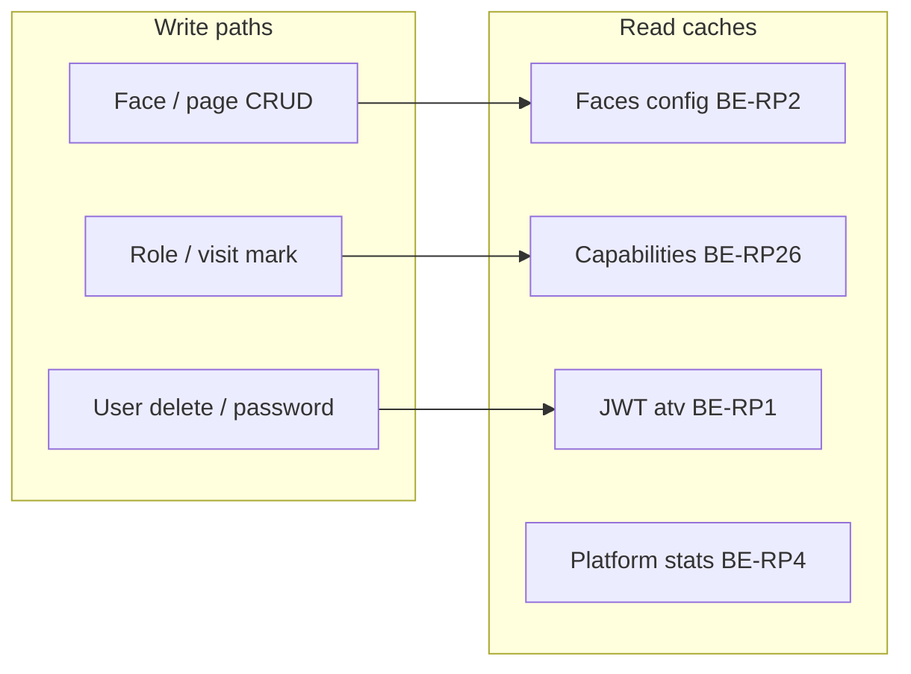

# Backend performance tuning

Ops guide for **BE-RP1…BE-RP35** (`many_faces_backend` **1.1.0**).

## Configuration (`Performance` section)

`many_faces_backend/BeDemo.Api/appsettings.json`:

| Key                               | Default | Update   |
| --------------------------------- | ------- | -------- |
| `AccessTokenVersionCacheSeconds`  | 45      | BE-RP1   |
| `FacesConfigCacheSeconds`         | 120     | BE-RP2   |
| `CapabilitiesCacheSeconds`        | 45      | BE-RP26  |
| `PlatformStatsCacheSeconds`       | 45      | BE-RP4   |
| `PublicStatsCacheSeconds`         | 60      | BE-RP4   |
| `AdminSearchAutocompleteCacheSeconds` | 15  | BE-RP6   |
| `SearchOutboxMaxParallelGrpc`     | 4       | BE-RP5   |
| `EfQueryTagsEnabled`              | false   | BE-RP29  |
| `UploadServeCacheMaxAgeSeconds`   | 300     | BE-RP28  |
| `HubUserDisplayCacheSeconds`      | 60      | BE-RP14  |
| `SearchGrpcDeadlineSeconds`       | 15      | BE-RP32  |

## Cache invalidation



| Cache              | Invalidation trigger                                      |
| ------------------ | --------------------------------------------------------- |
| JWT `atv`          | Password/role change, user delete (`SaveChanges` interceptor) |
| Faces config       | Face/page CRUD, visit mark, routing `"Faces"` key bump    |
| Capabilities       | Short TTL; face role changes                              |
| Platform stats     | TTL only (30–60s)                                         |

## PostgreSQL pool

Set explicit pool sizes on `ConnectionStrings:DefaultConnection` when running Operator AI + high API concurrency (BE-RP15):

```
Host=...;Database=...;Username=...;Password=...;Maximum Pool Size=100;Minimum Pool Size=5;Timeout=30
```

## Measurement

```bash
# Baseline JSON (BE-RP21)
node scripts/backend-perf-baseline.mjs http://localhost:8000 "$JWT"

# Optional load (BE-RP35) — requires k6
BE_JWT="$JWT" k6 run scripts/backend-load-test.k6.js
```

See [`many_faces_backend/docs/runtime-performance-v1.md`](../../many_faces_backend/docs/runtime-performance-v1.md).
