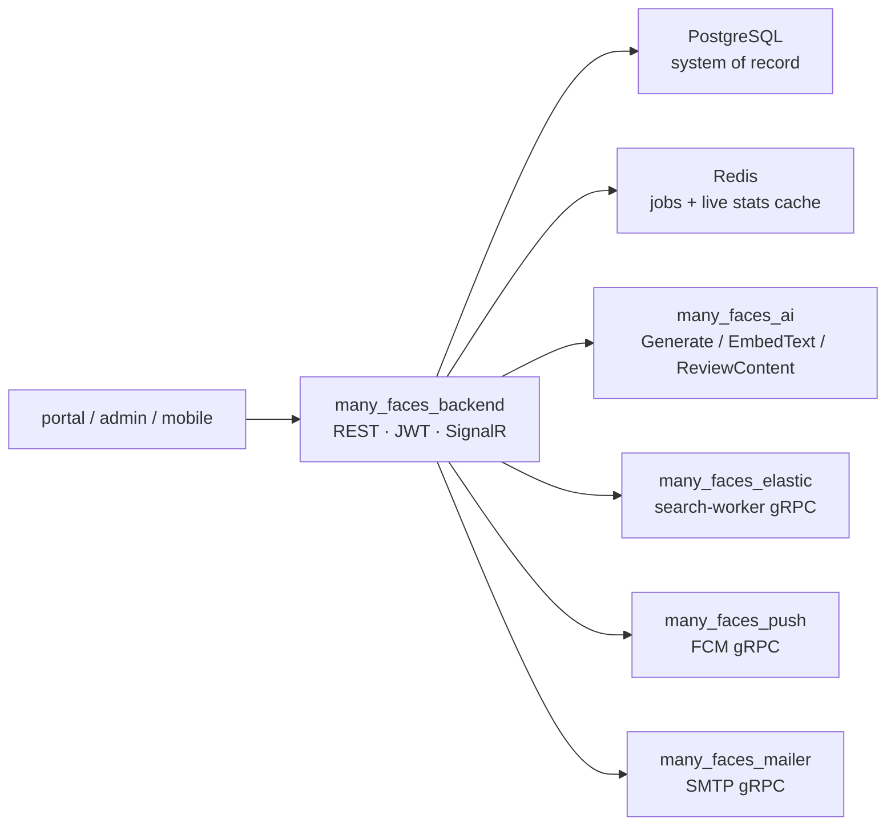
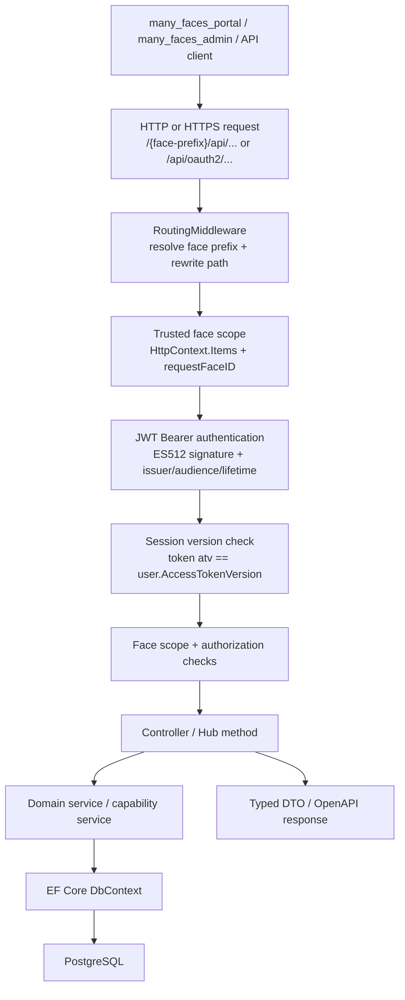
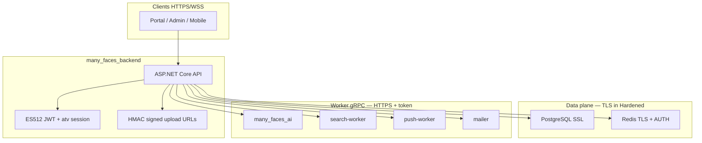
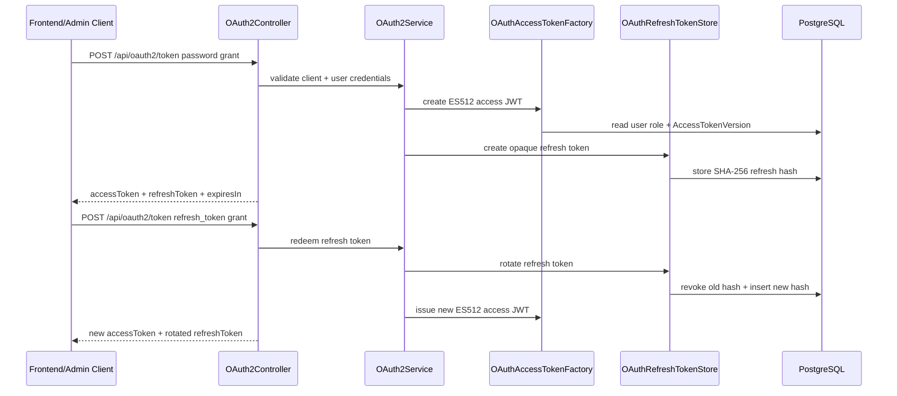
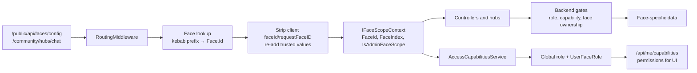
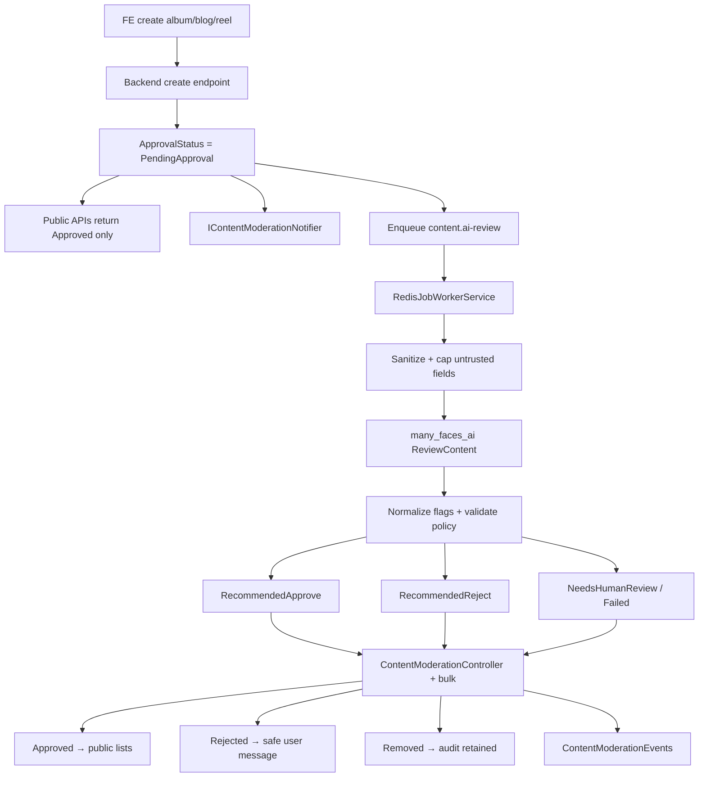
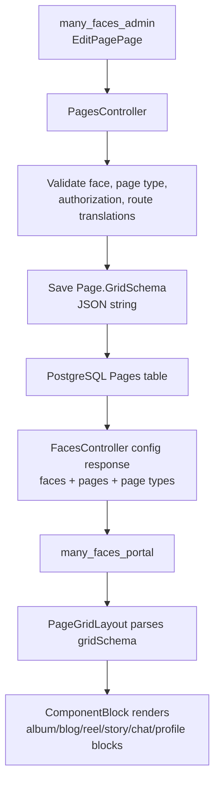
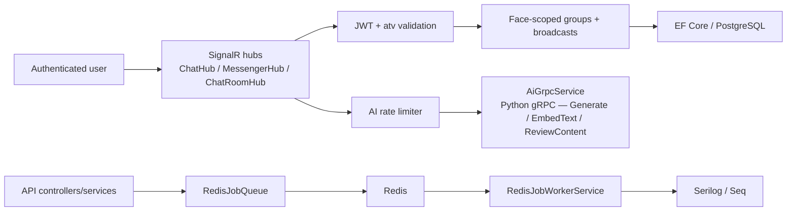

# Many Faces API

<!-- readme-badges:start -->

[](./VERSION)


[](https://github.com/01laky/many_faces_main/actions/workflows/ci.yml)


<!-- readme-badges:end -->

**Version:** [`1.6.3`](./VERSION) · [Changelog](./CHANGELOG.md)

**Author:** Ladislav Kostolny · [01laky@gmail.com](mailto:01laky@gmail.com)

> **The trust boundary for Many Faces AI.** This ASP.NET Core API owns authentication, face-scoped routing, authorization, PostgreSQL persistence, SignalR hubs, worker gRPC clients, Redis-backed jobs, OpenAPI contracts, and the operator AI orchestration path. Clients talk here — workers, Elasticsearch, and Ollama are reached through this API only.

---

## Quick Start

```bash
# Full stack (recommended)
cd many_faces_main
./scripts/start-all-dev.sh
```

| Endpoint  | URL                                        |
| --------- | ------------------------------------------ |
| API HTTP  | `http://localhost:8000`                    |
| API HTTPS | `https://localhost:8001`                   |
| Swagger   | `http://localhost:8000/swagger/index.html` |

**Guides:** [Local dev accounts](../docs/guides/local-dev-accounts.md) · [Local HTTPS](../docs/guides/dev-https.md) · [Operator AI runbook](../docs/guides/backend-stats-and-admin-ai-runbook.md)

---

## Architecture



### Backend request pipeline



### Trust boundary (BSH3)



---

## Three Pillars

| Pillar               | Highlights                                                                                                                                                                                                                                                                                                                                                                      |
| -------------------- | ------------------------------------------------------------------------------------------------------------------------------------------------------------------------------------------------------------------------------------------------------------------------------------------------------------------------------------------------------------------------------- |
| **Security (BSH3)**  | **ES512 JWT** + JWKS, **`atv`** session invalidation, face-scope middleware (anti-spoof), refresh rotation, rate limits, **HMAC signed upload URLs**, production **fallback deny**, gRPC **TLS + bearer** to workers. CI: `node ../scripts/verify-backend-security-tests.mjs`. Guide: [`../docs/guides/security-crypto-sockets.md`](../docs/guides/security-crypto-sockets.md). |
| **AI orchestration** | **Operator chat** (`ChatHub` → `many_faces_ai`), **RAG retrieval** (embed → ES kNN+BM25 → fresh-load → map+stitch), **`ReviewContent`** moderation jobs (Redis queue, sanitization before gRPC). Runbook: [`../docs/guides/backend-stats-and-admin-ai-runbook.md`](../docs/guides/backend-stats-and-admin-ai-runbook.md).                                                       |
| **Configuration**    | **Faces** + pages + **`gridSchema`** in PostgreSQL; **operator settings in DB** — mail SMTP, push FCM, search/AI modes; env bootstrap until admin saves. Optional workers toggled via `ENABLE_*=0`.                                                                                                                                                                             |

---

## What This Backend Provides

| Domain                 | Capabilities                                                                                                                                               |
| ---------------------- | ---------------------------------------------------------------------------------------------------------------------------------------------------------- |
| **Authentication**     | OAuth2/JWT: password + refresh grants, ES512 access tokens, JWKS, session invalidation (`atv`), refresh rotation (SHA-256 opaque tokens)                   |
| **Face scope**         | `RoutingMiddleware` resolves face prefix, strips caller-supplied `faceId`, stores trusted scope in `HttpContext.Items`                                     |
| **Authorization**      | Global roles + per-face `UserFaceRole`; `/api/me/capabilities` for UI; capability checks in all controllers                                                |
| **Social modules**     | Profiles, albums, blogs, reels, stories, wall listings, chats, comments, likes, follows, blocks, notifications                                             |
| **Grid pages**         | `Page.GridSchema` JSON: admin saves, portal renders                                                                                                        |
| **SignalR hubs**       | `ChatHub`, `MessengerHub`, `ChatRoomHub` — JWT + atv validated on connection                                                                               |
| **Operator AI**        | RAG chat (`ChatHub` → embed → ES retrieval → map+stitch → `GenerateStream`); content moderation queue (Redis → `ContentAiReviewService` → `ReviewContent`) |
| **Search**             | `AdminSearchController` autocomplete; `SearchOutbox` processor; `SearchIndexReconciliationHostedService`                                                   |
| **Push**               | FCM device registration (`POST /{face}/api/me/push-token`); worker dispatch via gRPC                                                                       |
| **Mail**               | Transactional templates via `many_faces_mailer` gRPC (registration code, password reset, email confirm)                                                    |
| **Operator stats**     | `GET /api/Stats`, `/timeseries` (JWT); `GET /api/Stats/public` (anonymous, `public` prefix)                                                                |
| **Admin self-profile** | `AdminMeProfileController` — identity, password, face roles, email confirm                                                                                 |
| **Operator user ops**  | `OperatorUsersController` — detail, bans, `userRoleId` patch, platform DMs                                                                                 |
| **Validation**         | FluentValidation (~76 schemas); `ValidationProblemDetails`; `IFileValidator` for uploads                                                                   |
| **i18n**               | Embedded `.resx`; `GET /api/localization/{app}` — `portal`, `admin`, `mobile`                                                                              |
| **Observability**      | Serilog + Seq; structured audit logs; Swagger (disabled in prod by default)                                                                                |

---

## Security Architecture (BSH3)

| Mechanism                | Implementation                                                                             |
| ------------------------ | ------------------------------------------------------------------------------------------ |
| **Signed access tokens** | ECDSA ES512, validated with issuer/audience/lifetime/algorithm/key checks                  |
| **Public JWKS**          | `GET /api/oauth2/jwks` — public key only, no private material                              |
| **Refresh rotation**     | Opaque high-entropy tokens; only SHA-256 hash stored; single-use, rotated on every grant   |
| **Session revocation**   | `atv` claim in every JWT; validated against `AccessTokenVersion` after every request       |
| **Face scope hardening** | URL-derived scope only; caller-supplied `faceId` / `requestFaceID` stripped and re-applied |
| **Capability contract**  | `/api/me/capabilities` for UI; backend always re-enforces                                  |
| **gRPC TLS**             | Optional TLS + bearer token to all workers; enforced in `Hardened` environment             |
| **Fallback deny**        | `FallbackPolicy` = authenticated; all unauthenticated routes opt-in via `[AllowAnonymous]` |
| **Swagger**              | Disabled in production unless `Swagger:EnableInProduction=true`                            |

```bash
# BSH3 hardened environment
ASPNETCORE_ENVIRONMENT=Hardened
# Requires https:// worker URLs + non-empty bearer tokens
```

---

## OAuth2, JWT, and Session Flow



---

## Face-Scoped Routing and Capabilities



---

## AI-Assisted Content Approval

New user-created content (albums, blogs, reels) is stored as `PendingApproval`, excluded from public views, and routed through an async AI review before a `SUPER_ADMIN` finalizes the decision.



**Safe decision rule:** AI recommends → backend policy validates → `SUPER_ADMIN` finalizes (AI never auto-publishes).

**Guide:** [`../docs/guides/ai-assisted-content-approval.md`](../docs/guides/ai-assisted-content-approval.md)

---

## Page Grid Schema Lifecycle



---

## Realtime, AI, and Background Work



---

## Technical Specification

| Dimension           | Details                                                                                                                  |
| ------------------- | ------------------------------------------------------------------------------------------------------------------------ |
| **Runtime**         | .NET 10 / ASP.NET Core Web API                                                                                           |
| **Persistence**     | EF Core 10, PostgreSQL, code-first migrations                                                                            |
| **Auth**            | JWT Bearer ES512; issuer/audience/lifetime/algorithm/key checks; zero clock skew                                         |
| **Token issuing**   | `OAuth2Service` → `OAuthClientValidator` + `OAuthAccessTokenFactory` + `OAuthRefreshTokenStore`                          |
| **Key management**  | `ECDSAKeyService` — stable P-521 keys via `Jwt:SigningPemPath` / `Jwt:KeyId`; ephemeral in dev                           |
| **Authorization**   | Global roles on `ApplicationUser.UserRoleId`; face roles in `UserFaceRole`; capabilities via `AccessCapabilitiesService` |
| **Redis**           | Optional at runtime; `RedisJobQueue` + `RedisJobWorkerService` when configured, no-op otherwise                          |
| **Observability**   | Serilog → console + Seq; security-sensitive operations at `SECURITY_AUDIT` level                                         |
| **Validation**      | FluentValidation ~76 schemas; `ValidationProblemDetails`; `IFileValidator` for uploads                                   |
| **Proto contracts** | Nested **`many_faces_proto`** submodule at `many_faces_backend/many_faces_proto/`                                        |

---

## Security Operations

```bash
# BSH3 hardened env vars (examples)
ConnectionStrings__DefaultConnection="...;SSL Mode=Require"
Jwt__SigningPemPath=/run/secrets/jwt-signing.pem
Uploads__SigningSecret=<strong-secret>
AiService__WorkerAuthToken=<token>
Search__WorkerAuthToken=<token>
Push__WorkerAuthToken=<token>
Mail__WorkerAuthToken=<token>
```

**Ops alerting:** Watch Seq/Dozzle for spikes of `authFailureReason=invalid_grant` or `invalid_client` on `/api/oauth2/token`, and HTTP **429** on OAuth/register/upload endpoints; audit lines prefixed `SECURITY_AUDIT` for password/role changes.

**Emergency session invalidation:** Bump `AccessTokenVersion` in the database and revoke `OAuthRefreshTokens` rows for a user.

**Full security backlog:** [`../docs/guides/security-crypto-sockets.md`](../docs/guides/security-crypto-sockets.md)

---

## Documentation

| Topic                       | Link                                                                                                                                                             |
| --------------------------- | ---------------------------------------------------------------------------------------------------------------------------------------------------------------- |
| **Security (BSH3)**         | [`appsettings.Hardened.json`](./BeDemo.Api/appsettings.Hardened.json) · [`../docs/guides/security-crypto-sockets.md`](../docs/guides/security-crypto-sockets.md) |
| **Auth / JWT / sessions**   | [`../docs/guides/authentication-and-sessions.md`](../docs/guides/authentication-and-sessions.md)                                                                 |
| **ACL / capabilities**      | [`../docs/guides/acl-and-capabilities.md`](../docs/guides/acl-and-capabilities.md)                                                                               |
| **Operator AI runbook**     | [`../docs/guides/backend-stats-and-admin-ai-runbook.md`](../docs/guides/backend-stats-and-admin-ai-runbook.md)                                                   |
| **Content approval**        | [`../docs/guides/ai-assisted-content-approval.md`](../docs/guides/ai-assisted-content-approval.md)                                                               |
| **Admin operator user**     | [`../docs/guides/admin-operator-user-detail.md`](../docs/guides/admin-operator-user-detail.md)                                                                   |
| **Admin profile**           | [`../docs/guides/admin-superadmin-profile.md`](../docs/guides/admin-superadmin-profile.md)                                                                       |
| **User chat**               | [`../docs/guides/admin-superadmin-user-chat.md`](../docs/guides/admin-superadmin-user-chat.md)                                                                   |
| **Dashboard + AI stats**    | [`../docs/guides/admin-dashboard-metrics.md`](../docs/guides/admin-dashboard-metrics.md)                                                                         |
| **RAG retrieval**           | [`../docs/guides/operator-ai-rag-retrieval.md`](../docs/guides/operator-ai-rag-retrieval.md)                                                                     |
| **Operator AI chat**        | [`../docs/guides/admin-operator-ai-chat-threads.md`](../docs/guides/admin-operator-ai-chat-threads.md)                                                           |
| **Global search**           | [`../docs/guides/admin-global-search-autocomplete.md`](../docs/guides/admin-global-search-autocomplete.md)                                                       |
| **Elasticsearch**           | [`../docs/guides/elasticsearch-search-features-overview.md`](../docs/guides/elasticsearch-search-features-overview.md)                                           |
| **Push notifications**      | [`../docs/guides/push-notifications-local-dev.md`](../docs/guides/push-notifications-local-dev.md)                                                               |
| **Mailer config**           | [`../docs/guides/admin-mailer-configuration.md`](../docs/guides/admin-mailer-configuration.md)                                                                   |
| **Infra smoke tests**       | [`../docs/guides/admin-settings-infrastructure-smoke-tests.md`](../docs/guides/admin-settings-infrastructure-smoke-tests.md)                                     |
| **Email registration**      | [`../docs/guides/email-code-registration.md`](../docs/guides/email-code-registration.md)                                                                         |
| **API validation**          | [`../docs/guides/api-request-validation.md`](../docs/guides/api-request-validation.md)                                                                           |
| **i18n**                    | [`../docs/guides/static-localization-and-i18n.md`](../docs/guides/static-localization-and-i18n.md)                                                               |
| **Runtime performance**     | [`docs/runtime-performance-v1.md`](./docs/runtime-performance-v1.md) · [`../docs/guides/backend-performance.md`](../docs/guides/backend-performance.md)          |
| **Observability**           | [`../docs/guides/observability-seq-and-logs.md`](../docs/guides/observability-seq-and-logs.md)                                                                   |
| **Local HTTPS**             | [`../docs/guides/dev-https.md`](../docs/guides/dev-https.md)                                                                                                     |
| **Docker Compose**          | [`../docs/guides/docker-and-compose.md`](../docs/guides/docker-and-compose.md)                                                                                   |
| **OAuth2 + Stories (curl)** | [`STORIES_API.md`](./STORIES_API.md) · [`../docs/guides/api-oauth-stories-curl.md`](../docs/guides/api-oauth-stories-curl.md)                                    |
| **Detailed reference**      | [`docs/DETAILED_README.md`](./docs/DETAILED_README.md) (features, endpoints, ER diagram)                                                                         |
| **Monorepo docs hub**       | [`../docs/README.md`](../docs/README.md)                                                                                                                         |

---

## Monorepo Integration

This backend is the `many_faces_backend/` submodule of [`many_faces_main`](https://github.com/01laky/many_faces_main). Wire contracts are in **`many_faces_proto`** (nested submodule at `many_faces_backend/many_faces_proto/`).

```bash
# Initialize nested proto submodule
git submodule update --init --recursive
```

Full stack starts with `../scripts/start-all-dev.sh` from the monorepo root.

### Git hooks

Husky + commitlint run via Yarn in this repo. After cloning, run **`yarn install`** once so `.husky/commit-msg` can resolve `yarn exec commitlint`.

---

## Project Status

Active core component of the **Many Faces AI** reference monorepo. v1.4.40 — all X7 controllers carry `[ProducesResponseType]` attributes and zero anonymous response bodies. Security hardening BSH3 shipped. Tracked in [`CHANGELOG.md`](./CHANGELOG.md).
