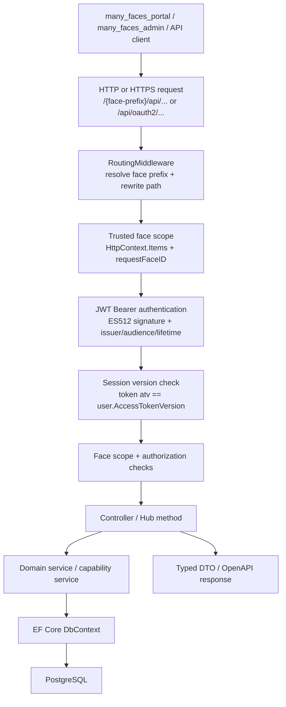
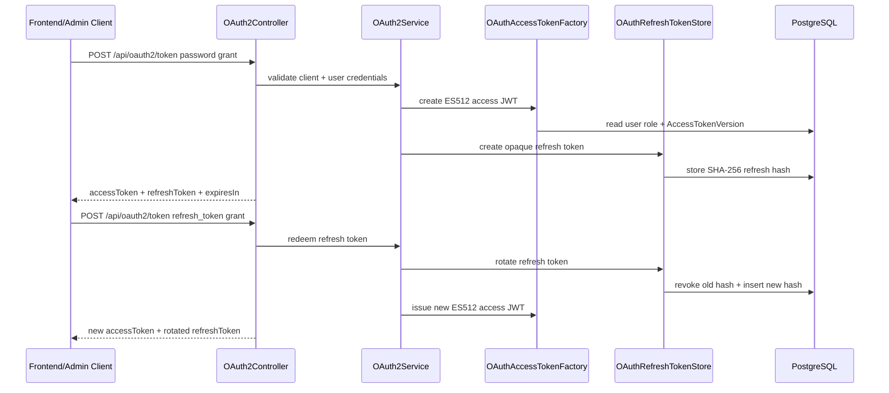
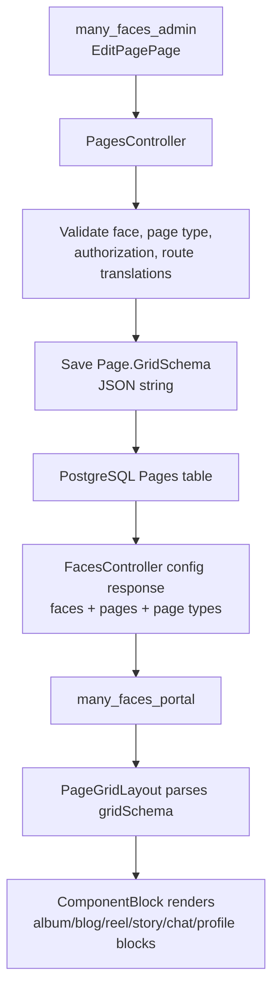
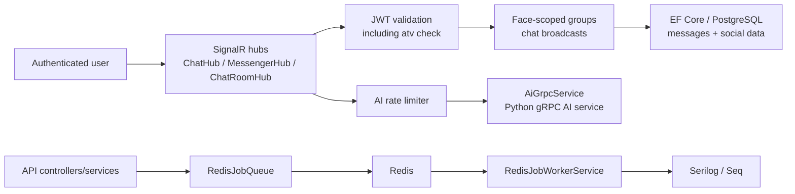
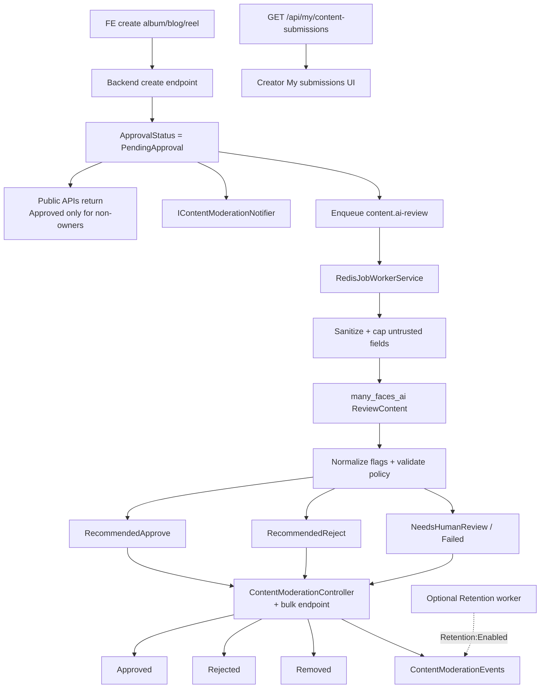

# Many Faces API

ASP.NET Core WebAPI project with Identity framework and PostgreSQL database.

## Overview

The Backend API (**many_faces_backend**; monorepo path `many_faces_backend/`) provides a RESTful API for user authentication, authorization, and management. It uses ASP.NET Core Identity for user management, Entity Framework Core for access to PostgreSQL, and OAuth2-issued JWTs for bearer APIs.

The backend is the trust boundary for the Many Faces AI demo. It owns authentication, token issuing, face-aware request routing, role and capability evaluation, persisted social data, page/grid schemas, real-time hubs, AI integration, Redis-backed background work, structured logs, and OpenAPI contracts consumed by the frontend and admin submodules.

For users, this API is what keeps each face experience coherent: it returns the correct face configuration, page structure, social content, chat data, profile data, media modules, role state, and available actions. For admins, it stores the structural configuration that drives the user-facing frontend, especially pages and their `gridSchema` JSON layouts.

For engineers, the backend is designed as a layered ASP.NET Core service: middleware resolves face scope, authentication validates ES512 JWTs, authorization and capability services evaluate roles, controllers expose typed HTTP resources, EF Core persists data in PostgreSQL, SignalR hubs provide real-time channels, Redis supports queue-style infrastructure, and generated OpenAPI clients keep the React apps typed.

## What This Backend Provides

- OAuth2/JWT authentication for frontend and admin clients.
- Signed ES512 access tokens, public JWKS validation keys, refresh-token based sessions, and explicit token expiry handling.
- Opaque refresh tokens stored server-side as SHA-256 hashes and rotated on every refresh grant.
- Session invalidation through the `atv` access-token version claim and `ApplicationUser.AccessTokenVersion`.
- Face-prefixed API and hub routing that resolves the active face from the URL and applies trusted server-side scope.
- Backend-enforced checks for face-specific data access, admin operations, role selection, and private face behaviour.
- Capability responses through `/api/me/capabilities` so clients can render role-aware UI without guessing.
- CRUD and domain APIs for users, faces, pages, page types, route translations, profiles, albums, blogs, reels, stories, wall listings, chats, comments, likes, follows, blocks, and notifications.
- Page `gridSchema` persistence used by **many_faces_admin** (`many_faces_admin/`) to configure layouts and by **many_faces_portal** (`many_faces_portal/`) to render them.
- SignalR hubs for chat and real-time communication.
- **Operator statistics APIs:** `GET /api/Stats`, `GET /api/Stats/timeseries` (JWT + **`CanManageAllFaces`**), and **`GET /api/Stats/public`** (anonymous aggregate counts on the **`public`** face prefix only). Counts for the full dashboard are centralized in **`IPlatformStatsQueryService`**.
- AI gRPC client integration (**`Generate`** with optional **`stats_context_json`**, **`OperatorStatsChat`**, **`ReviewContent`**) and Redis-backed queue infrastructure for asynchronous workflows.
- **Optional Elasticsearch search projection:** gRPC **`SearchService`** client to the Go **search-worker** in **`many_faces_elastic`** (shipping path does not open Elasticsearch HTTP from the API process); see monorepo [`docs/guides/elasticsearch-search-features-overview.md`](../../docs/guides/elasticsearch-search-features-overview.md), [`docs/guides/elasticsearch-local-dev.md`](../../docs/guides/elasticsearch-local-dev.md), and [`docs/guides/elasticsearch-grpc-tls-mtls.md`](../../docs/guides/elasticsearch-grpc-tls-mtls.md).
- **Optional FCM push dispatch:** gRPC **`PushService`** client to the Go **push-worker** in **`many_faces_push`**; device registration via **`POST /{face}/api/me/push-token`** and removal via **`DELETE /{face}/api/me/push-token`**; operator smoke via **`POST /api/admin/push/test-self`**. See [`docs/guides/push-notifications-local-dev.md`](../../docs/guides/push-notifications-local-dev.md).
- **Worker `.proto` source:** **`many_faces_proto`** submodule at monorepo root (`..\..\many_faces_proto\proto\manyfaces\...` from `BeDemo.Api/`). Use **`git submodule update --init --recursive`**. AI **`HealthService`** still uses local **`Protos/health.proto`**.
- Structured Serilog/Seq logging, Swagger/OpenAPI documentation, migrations, seed data, and unit/integration tests.

## Technical Specification

- **Runtime:** .NET 10 / ASP.NET Core Web API.
- **Persistence:** EF Core 10 with PostgreSQL, code-first migrations, Identity tables, OAuth clients, refresh tokens, faces, page schemas, and social-module tables.
- **Authentication:** ASP.NET Core JWT Bearer authentication with ES512 validation, issuer/audience checks, zero clock skew, and SignalR query-token support for hub connections.
- **Token issuing:** `OAuth2Service` orchestrates password and refresh-token grants through `OAuthClientValidator`, `OAuthAccessTokenFactory`, `OAuthTokenRequestSignatureVerifier`, and `OAuthRefreshTokenStore`.
- **Key management:** `ECDSAKeyService` supports stable P-521 signing keys through `Jwt:SigningPemPath` and `Jwt:KeyId`; development can use ephemeral keys.
- **Authorization model:** global roles live on `ApplicationUser.UserRoleId`; face-specific roles live in `UserFaceRole`; capability keys are computed by `AccessCapabilitiesService`.
- **Face scope:** `RoutingMiddleware` rewrites `/{face-prefix}/api/...` and `/{face-prefix}/hubs/...`, strips caller-supplied scope query parameters, and stores trusted face metadata in `HttpContext.Items`.
- **Admin scope:** the admin face prefix can preserve an explicit `faceId` query for cross-face operations, but admin role/capability checks still gate privileged behaviour.
- **Grid pages:** `PagesController` stores `Page.GridSchema`; admin edits serialize JSON and frontend rendering consumes it as read-only layout data.
- **Realtime:** SignalR hubs are protected by `[Authorize]`; hub JWT validation uses the same access-token signature and session-version checks as REST APIs.
- **Infrastructure:** Redis is optional at runtime; when configured, `RedisJobQueue` and `RedisJobWorkerService` are registered, otherwise a no-op queue is used.
- **Observability:** Serilog writes structured logs to console/Seq; security-sensitive operations use audit-style logging where relevant.

## Security Architecture And Solution Design

Security is designed around explicit, layered checks rather than implicit client trust:

- **Signed access tokens:** access JWTs are signed with ECDSA ES512 and validated with issuer, audience, lifetime, algorithm, and signing-key checks.
- **Public verification keys:** `/api/oauth2/jwks` exposes public keys for access-token verification without exposing private signing material.
- **Refresh-token rotation:** refresh tokens are high-entropy opaque strings; only SHA-256 hashes are stored; every refresh redemption revokes the old token and issues a replacement.
- **Replay resistance:** PostgreSQL refresh redemption uses serializable transactions to reduce double-spend risk for the same refresh token under concurrency.
- **Session revocation:** every access token carries `atv`; after token validation the backend compares it with `ApplicationUser.AccessTokenVersion` and rejects stale tokens.
- **Password reset hardening:** admin password reset increments `AccessTokenVersion` and revokes active refresh tokens for that user.
- **Face-scope hardening:** URL-derived face scope is resolved server-side; caller-supplied `faceId` / `requestFaceID` query parameters are stripped and re-applied from trusted routing state.
- **Capability contract:** clients use `/api/me/capabilities` for UI decisions, but server controllers and services still enforce permissions.
- **Protected admin operations:** page type mutations, cross-face operations, admin routes, and sensitive user operations require backend role/capability checks.
- **SignalR security:** hubs require authentication, accept bearer tokens through the WebSocket query only for `/hubs`, and still run JWT/session-version validation.
- **Operational safety:** Swagger is disabled in production unless explicitly enabled, stable signing keys are configurable, and emergency session invalidation is documented.

The intended solution shape is:

- Keep all durable security decisions in the backend.
- Let frontend/admin read capabilities for better UX, but never make those capabilities the only enforcement layer.
- Treat face scope as request context derived by middleware, not as a client-controlled query value.
- Store grid layouts as data (`gridSchema`) while rendering remains the responsibility of clients.
- Prefer typed OpenAPI clients and DTOs over hand-written request contracts.
- Keep cryptographic and token-lifecycle decisions documented because they affect operations, incident response, and future hardening.

## Backend Request Pipeline

## Operator statistics and admin AI chat (optional)

The **admin dashboard** uses **`GET /api/Stats`** and **`GET /api/Stats/timeseries`** with a platform-operator JWT under the **admin** face prefix. **`GET /api/Stats/public`** returns **`PublicStatsSnapshotDto`** (counts only) and is **`[AllowAnonymous]`** when called under the **`public`** face prefix — used for optional **AI chat** context (**SignalR** `SendToAiWithOperatorStats`, gRPC **`Generate`** / **`OperatorStatsChat`**). Configure **`AiStats:PublicSnapshotAbsoluteUrl`** for **live** mode. Full write-up: monorepo [`docs/guides/admin-dashboard-metrics.md`](../../docs/guides/admin-dashboard-metrics.md).

## OAuth2, JWT, And Session Flow

## Face-Scoped Routing And Capabilities

## Page Grid Schema Lifecycle

## Realtime, AI, And Background Work

## AI-Assisted Content Approval

The backend is the source of truth for the approval workflow for regular FE user-created albums, blogs, and reels. New user-created content is stored as `PendingApproval`, excluded from public grid/list/detail queries, and routed into a review process before it can become public. Full design: [`docs/guides/ai-assisted-content-approval.md`](../docs/guides/ai-assisted-content-approval.md).

Backend responsibilities:

- Persist approval status and moderation metadata for albums, blogs, and reels.
- Default existing/admin-created content to `Approved` unless product changes that rule.
- Default regular FE-created content to `PendingApproval`.
- Keep public queries filtered to `Approved` content only.
- Create AI review job records and enqueue review work instead of calling AI synchronously from create requests.
- Store AI recommendation metadata separately from final approval status.
- Apply backend policy before any AI recommendation changes public visibility.
- Strip delimiter-smuggling characters from creator text before it reaches the AI process, and treat obvious instruction-like phrases as **human-review** when the model still returns **Approve** (configurable via `ContentModeration:InstructionHeuristicEnabled`).
- Expose protected moderation APIs restricted to `SUPER_ADMIN` for approve/reject/remove in this phase.
- Write moderation audit events for submit, queue, AI recommendation, approve, reject, remove, and override transitions.

Safe decision rule:

- AI recommends.
- Backend policy validates.
- `SUPER_ADMIN` finalizes unless a future controlled auto-approval policy is explicitly enabled.

Implemented backend pieces:

- `ContentApprovalStatus`, `AiReviewStatus`, AI decision/risk enums, `AiReviewJob`, and `ContentModerationEvent`.
- Moderation metadata fields on `Album`, `Blog`, and `Reel`.
- `ContentModerationController` for filterable queue listing, `{ metrics, alerts }`, audit events, single-item approve/reject/remove/requeue, and **bulk** moderation with per-item results.
- `MyContentSubmissionsController` (`GET /api/my/content-submissions`) for authenticated creators — unified pending items with safe fields and `canEdit` / `canDelete`.
- `ContentAiReviewService` for `content.ai-review` job processing: **sanitized gRPC payloads**, optional **`instruction_like_text`** heuristic on stored content, structured `ReviewContent` calls, **normalized AI flags**, policy validation, retry scheduling, stale-version protection, and escalation to `NeedsHumanReview`.
- `ContentModerationSecurityOptions` (`ContentModeration:` in configuration) toggles the instruction heuristic (default on).
- `IContentModerationNotifier` for in-app notifications on submit and when AI exhausts retries.
- Optional `ContentRetentionCleanupService` + hosted worker (see `Retention` configuration) for dry-run or executed redaction of internal AI trace fields after policy delay.
- Migration defaults that preserve existing content as `Approved`.
- Integration tests covering visibility, bulk moderation, metrics/alerts wiring, retention behaviour, audit writes, and **moderation security edge cases** (see `ContentModerationTests`, `ContentModerationSecurityEdgeTests`).

## Security (operations)

- **OAuth token code layout:** `OAuth2Service` orchestrates grants; `OAuthClientValidator` (DB clients), `OAuthAccessTokenFactory` (ES512 access JWT + misuse-as-refresh guard), `OAuthTokenRequestSignatureVerifier` (legacy body signature, `IClock` for tests), `OAuthRefreshTokenStore`. See monorepo [`docs/guides/authentication-and-sessions.md`](../docs/guides/authentication-and-sessions.md) (section 2). Unit tests: `OAuth*Tests` in `BeDemo.Api.Tests`.
- **JWKS:** `GET /api/oauth2/jwks` — public key for ES512 JWT validation.
- **Stable signing key:** set `Jwt:SigningPemPath` (path to EC private key PEM, P-521) and `Jwt:KeyId` in configuration; leave empty for ephemeral dev keys.
- **Session invalidation (J6):** access tokens carry claim `atv` (matches `AspNetUsers.AccessTokenVersion`). Admin **password reset** via `PUT /api/users/{id}` increments the version and revokes refresh tokens for that user.
- **Swagger in production:** disabled unless `Swagger:EnableInProduction` is `true`.
- **Emergency:** bump `AccessTokenVersion` in the database and revoke `OAuthRefreshTokens` rows for a user to invalidate all sessions.
- **Security backlog / deferred follow-ups:** in the monorepo root, see [`docs/guides/security-crypto-sockets.md`](../docs/guides/security-crypto-sockets.md) (baseline table, **Deferred follow-ups**, and **Security hardening engagement — completion record** with §16–§18 evidence).

## Detailed reference (features, endpoints, migrations, diagram)

Long tables (**Features**, **API Endpoints**, routing, **Configuration**, **Migrations**, **Testing**, **Troubleshooting**, and the **ER diagram**) live under **[`docs/reference/`](./docs/reference/)** with an index at **[`docs/DETAILED_README.md`](./docs/DETAILED_README.md)** so this README stays a shorter entry point.

**Stories HTTP API** (curl-oriented table): **[`STORIES_API.md`](./STORIES_API.md)** (see also [`docs/guides/api-oauth-stories-curl.md`](../docs/guides/api-oauth-stories-curl.md)).

## Additional Documentation

- **Observability (Seq, logs):** [`docs/guides/observability-seq-and-logs.md`](../docs/guides/observability-seq-and-logs.md)
- **Local HTTPS / certs / ports:** [`docs/guides/dev-https.md`](../docs/guides/dev-https.md)
- **Docker Compose (monorepo):** root [`docker-compose.dev.yml`](../docker-compose.dev.yml) and [`docs/guides/docker-and-compose.md`](../docs/guides/docker-and-compose.md)

### Monorepo documentation hub (`many_faces_main`)

With the backend checked out as **`many_faces_main/many_faces_backend/`**, open the parent docs tree:

- [Documentation hub](../docs/README.md)
- [AI-assisted content approval](../docs/guides/ai-assisted-content-approval.md)
- [Git submodules](../docs/guides/git-submodules.md)
- [Development and CI](../docs/guides/development.md)

If you use a **standalone clone** of only `many_faces_backend` (no sibling `docs/` folder), browse the same files in the **`many_faces_main`** repository on your host (fork-friendly paths above work only inside the monorepo layout).

### Git hooks (commitlint) in this submodule

Husky + commitlint run via **Yarn** in this repo. After `git clone`, run **`yarn install`** once under `many_faces_backend/` so `.husky/commit-msg` can resolve `yarn exec commitlint` (see monorepo [`docs/guides/development.md`](../docs/guides/development.md) — *Git hooks*).
