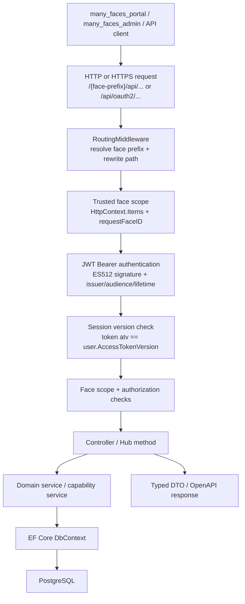
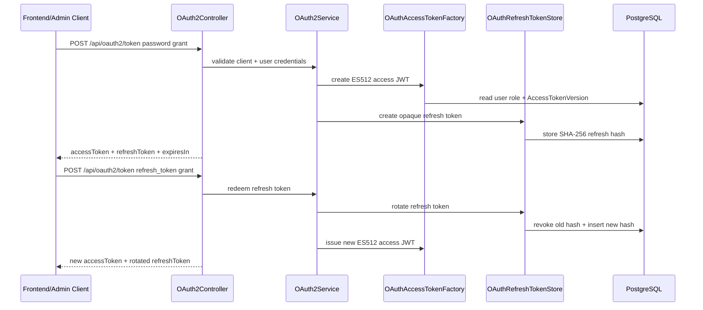
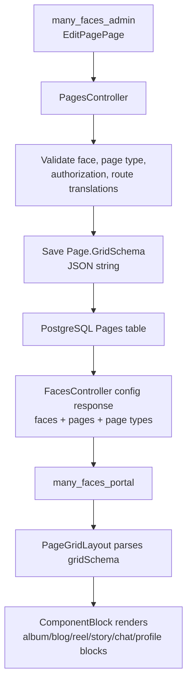
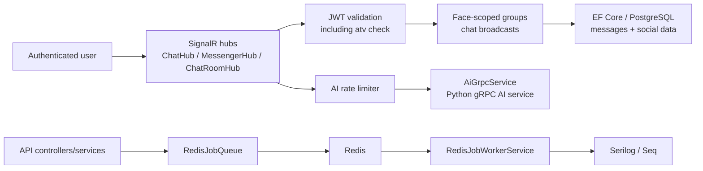
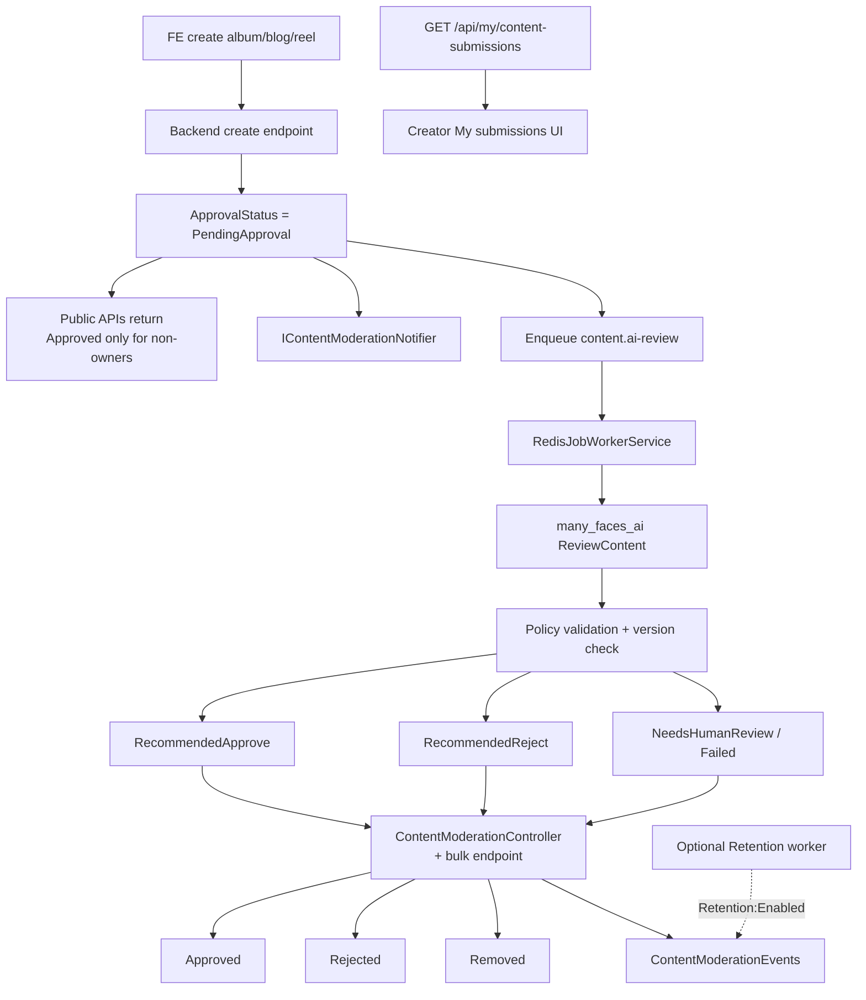

# Be Demo API

ASP.NET Core WebAPI project with Identity framework and PostgreSQL database.

## Overview

The Backend API (**many_faces_backend**; monorepo path `many_faces_backend/`) provides a RESTful API for user authentication, authorization, and management. It uses ASP.NET Core Identity for user management, Entity Framework Core for access to PostgreSQL, and OAuth2-issued JWTs for bearer APIs.

The backend is the trust boundary for the Many Faces AI demo. It owns authentication, token issuing, face-aware request routing, role and capability evaluation, persisted social data, page/grid schemas, real-time hubs, AI integration, Redis-backed background work, structured logs, and OpenAPI contracts consumed by the frontend and admin submodules.

For users, this API is what keeps each face experience coherent: it returns the correct face configuration, page structure, social content, chat data, profile data, media modules, role state, and available actions. For admins, it stores the structural configuration that drives the user-facing frontend, especially pages and their `gridSchema` JSON layouts.

For engineers, the backend is designed as a layered ASP.NET Core service: middleware resolves face scope, authentication validates ES512 JWTs, authorization and capability services evaluate roles, controllers expose typed HTTP resources, EF Core persists data in PostgreSQL, SignalR hubs provide real-time channels, Redis supports queue-style infrastructure, and generated OpenAPI clients keep the React apps typed.

## What This Backend Provides

- OAuth2/JWT authentication for frontend and admin clients.
- Signed ES512 access tokens, public JWKS validation keys, refresh-token based sessions, and explicit token expiry handling.
- Opaque refresh tokens stored server-side as SHA-256 hashes and rotated on every refresh grant.
- Session invalidation through the `atv` access-token version claim and `ApplicationUser.AccessTokenVersion`.
- Face-prefixed API and hub routing that resolves the active face from the URL and applies trusted server-side scope.
- Backend-enforced checks for face-specific data access, admin operations, role selection, and private face behaviour.
- Capability responses through `/api/me/capabilities` so clients can render role-aware UI without guessing.
- CRUD and domain APIs for users, faces, pages, page types, route translations, profiles, albums, blogs, reels, stories, wall listings, chats, comments, likes, follows, blocks, and notifications.
- Page `gridSchema` persistence used by **many_faces_admin** (`many_faces_admin/`) to configure layouts and by **many_faces_portal** (`many_faces_portal/`) to render them.
- SignalR hubs for chat and real-time communication.
- AI gRPC client integration and Redis-backed queue infrastructure for asynchronous workflows.
- Structured Serilog/Seq logging, Swagger/OpenAPI documentation, migrations, seed data, and unit/integration tests.

## Technical Specification

- **Runtime:** .NET 10 / ASP.NET Core Web API.
- **Persistence:** EF Core 10 with PostgreSQL, code-first migrations, Identity tables, OAuth clients, refresh tokens, faces, page schemas, and social-module tables.
- **Authentication:** ASP.NET Core JWT Bearer authentication with ES512 validation, issuer/audience checks, zero clock skew, and SignalR query-token support for hub connections.
- **Token issuing:** `OAuth2Service` orchestrates password and refresh-token grants through `OAuthClientValidator`, `OAuthAccessTokenFactory`, `OAuthTokenRequestSignatureVerifier`, and `OAuthRefreshTokenStore`.
- **Key management:** `ECDSAKeyService` supports stable P-521 signing keys through `Jwt:SigningPemPath` and `Jwt:KeyId`; development can use ephemeral keys.
- **Authorization model:** global roles live on `ApplicationUser.UserRoleId`; face-specific roles live in `UserFaceRole`; capability keys are computed by `AccessCapabilitiesService`.
- **Face scope:** `RoutingMiddleware` rewrites `/{face-prefix}/api/...` and `/{face-prefix}/hubs/...`, strips caller-supplied scope query parameters, and stores trusted face metadata in `HttpContext.Items`.
- **Admin scope:** the admin face prefix can preserve an explicit `faceId` query for cross-face operations, but admin role/capability checks still gate privileged behaviour.
- **Grid pages:** `PagesController` stores `Page.GridSchema`; admin edits serialize JSON and frontend rendering consumes it as read-only layout data.
- **Realtime:** SignalR hubs are protected by `[Authorize]`; hub JWT validation uses the same access-token signature and session-version checks as REST APIs.
- **Infrastructure:** Redis is optional at runtime; when configured, `RedisJobQueue` and `RedisJobWorkerService` are registered, otherwise a no-op queue is used.
- **Observability:** Serilog writes structured logs to console/Seq; security-sensitive operations use audit-style logging where relevant.

## Security Architecture And Solution Design

Security is designed around explicit, layered checks rather than implicit client trust:

- **Signed access tokens:** access JWTs are signed with ECDSA ES512 and validated with issuer, audience, lifetime, algorithm, and signing-key checks.
- **Public verification keys:** `/api/oauth2/jwks` exposes public keys for access-token verification without exposing private signing material.
- **Refresh-token rotation:** refresh tokens are high-entropy opaque strings; only SHA-256 hashes are stored; every refresh redemption revokes the old token and issues a replacement.
- **Replay resistance:** PostgreSQL refresh redemption uses serializable transactions to reduce double-spend risk for the same refresh token under concurrency.
- **Session revocation:** every access token carries `atv`; after token validation the backend compares it with `ApplicationUser.AccessTokenVersion` and rejects stale tokens.
- **Password reset hardening:** admin password reset increments `AccessTokenVersion` and revokes active refresh tokens for that user.
- **Face-scope hardening:** URL-derived face scope is resolved server-side; caller-supplied `faceId` / `requestFaceID` query parameters are stripped and re-applied from trusted routing state.
- **Capability contract:** clients use `/api/me/capabilities` for UI decisions, but server controllers and services still enforce permissions.
- **Protected admin operations:** page type mutations, cross-face operations, admin routes, and sensitive user operations require backend role/capability checks.
- **SignalR security:** hubs require authentication, accept bearer tokens through the WebSocket query only for `/hubs`, and still run JWT/session-version validation.
- **Operational safety:** Swagger is disabled in production unless explicitly enabled, stable signing keys are configurable, and emergency session invalidation is documented.

The intended solution shape is:

- Keep all durable security decisions in the backend.
- Let frontend/admin read capabilities for better UX, but never make those capabilities the only enforcement layer.
- Treat face scope as request context derived by middleware, not as a client-controlled query value.
- Store grid layouts as data (`gridSchema`) while rendering remains the responsibility of clients.
- Prefer typed OpenAPI clients and DTOs over hand-written request contracts.
- Keep cryptographic and token-lifecycle decisions documented because they affect operations, incident response, and future hardening.

## Backend Request Pipeline



## OAuth2, JWT, And Session Flow



## Face-Scoped Routing And Capabilities


## Page Grid Schema Lifecycle



## Realtime, AI, And Background Work



## AI-Assisted Content Approval

The backend is the source of truth for the approval workflow for regular FE user-created albums, blogs, and reels. New user-created content is stored as `PendingApproval`, excluded from public grid/list/detail queries, and routed into a review process before it can become public. Full design: [`docs/guides/ai-assisted-content-approval.md`](../docs/guides/ai-assisted-content-approval.md).

Backend responsibilities:

- Persist approval status and moderation metadata for albums, blogs, and reels.
- Default existing/admin-created content to `Approved` unless product changes that rule.
- Default regular FE-created content to `PendingApproval`.
- Keep public queries filtered to `Approved` content only.
- Create AI review job records and enqueue review work instead of calling AI synchronously from create requests.
- Store AI recommendation metadata separately from final approval status.
- Apply backend policy before any AI recommendation changes public visibility.
- Expose protected moderation APIs restricted to `SUPER_ADMIN` for approve/reject/remove in this phase.
- Write moderation audit events for submit, queue, AI recommendation, approve, reject, remove, and override transitions.

Safe decision rule:

- AI recommends.
- Backend policy validates.
- `SUPER_ADMIN` finalizes unless a future controlled auto-approval policy is explicitly enabled.

Implemented backend pieces:

- `ContentApprovalStatus`, `AiReviewStatus`, AI decision/risk enums, `AiReviewJob`, and `ContentModerationEvent`.
- Moderation metadata fields on `Album`, `Blog`, and `Reel`.
- `ContentModerationController` for filterable queue listing, `{ metrics, alerts }`, audit events, single-item approve/reject/remove/requeue, and **bulk** moderation with per-item results.
- `MyContentSubmissionsController` (`GET /api/my/content-submissions`) for authenticated creators — unified pending items with safe fields and `canEdit` / `canDelete`.
- `ContentAiReviewService` for `content.ai-review` job processing, structured gRPC calls, retry scheduling, stale-version protection, and escalation to `NeedsHumanReview`.
- `IContentModerationNotifier` for in-app notifications on submit and when AI exhausts retries.
- Optional `ContentRetentionCleanupService` + hosted worker (see `Retention` configuration) for dry-run or executed redaction of internal AI trace fields after policy delay.
- Migration defaults that preserve existing content as `Approved`.
- Integration tests covering visibility, bulk moderation, metrics/alerts wiring, retention behaviour, and audit writes (see `ContentModerationTests`).



## Security (operations)

- **OAuth token code layout:** `OAuth2Service` orchestrates grants; `OAuthClientValidator` (DB clients), `OAuthAccessTokenFactory` (ES512 access JWT + misuse-as-refresh guard), `OAuthTokenRequestSignatureVerifier` (legacy body signature, `IClock` for tests), `OAuthRefreshTokenStore`. See monorepo [`docs/guides/authentication-and-sessions.md`](../docs/guides/authentication-and-sessions.md) (section 2). Unit tests: `OAuth*Tests` in `BeDemo.Api.Tests`.
- **JWKS:** `GET /api/oauth2/jwks` — public key for ES512 JWT validation.
- **Stable signing key:** set `Jwt:SigningPemPath` (path to EC private key PEM, P-521) and `Jwt:KeyId` in configuration; leave empty for ephemeral dev keys.
- **Session invalidation (J6):** access tokens carry claim `atv` (matches `AspNetUsers.AccessTokenVersion`). Admin **password reset** via `PUT /api/users/{id}` increments the version and revokes refresh tokens for that user.
- **Swagger in production:** disabled unless `Swagger:EnableInProduction` is `true`.
- **Emergency:** bump `AccessTokenVersion` in the database and revoke `OAuthRefreshTokens` rows for a user to invalidate all sessions.
- **Security backlog / deferred follow-ups:** in the monorepo root, see [`docs/guides/security-crypto-sockets.md`](../docs/guides/security-crypto-sockets.md) (baseline table, **Deferred follow-ups**, and **Security hardening engagement — completion record** with §16–§18 evidence).

## Features

- **User Authentication & Authorization**
  - OAuth2 token-based authentication
  - User registration and login
  - JWT token generation and validation
  - Refresh token support

- **Database Integration**
  - Entity Framework Core with PostgreSQL
  - Code-first migrations
  - Automatic database seeding (admin user creation)

- **Roles (global and face-scoped)**
  - **Global roles** (one per user): SUPER_ADMIN, ADMIN, USER, HOST — stored in `ApplicationUser.UserRoleId`.
  - **Face roles** (per user per face): FACE_ADMIN, FACE_USER, INZERENT, SUBSCRIBER, FACE_HOST — stored in `UserFaceRole` (UserId, FaceId, UserRoleId).
  - On **registration**: user gets global role **USER**; for each face they get **UserFaceRole** with **FACE_HOST**.
  - **First visit to a private face**: frontend can show a role selector; user chooses role and backend **PUT /api/faces/{id}/my-role** updates or creates `UserFaceRole`. Config endpoint returns **myFaceRoleId** / **myFaceRoleName** when called with Authorization.
  - See `UserRole.GlobalRoleNames`, `UserRole.FaceRoleNames`, and `RoleScope` (Global/Face).

- **Default pages when creating a face**
  - Creating a face (POST /api/faces) adds **Home** (`/home`). If the face is **non-public**, a **Wall** page (`/wall`) is added. **PageTypes** in CMS are only **`home`**, **`static`**, **`wall`** (e.g. login/register use `static` on the public face). Typed **list/detail** UIs are frontend routes, not CMS page types.

- **API Documentation**
  - Swagger/OpenAPI documentation
  - Interactive API explorer at `/swagger`

- **Structured Logging**
  - Serilog integration
  - Seq logging server for log viewing and analysis
  - Console and Seq sinks

- **SignalR Support**
  - Real-time communication via SignalR hubs
  - Chat hub implementation

- **Multi-Tenant Face-Based Routing**
  - URL-based tenant identification via face prefix (e.g., `/acme-corp/dashboard`)
  - Automatic URL rewriting from `/{face-prefix}/{path}` to `/api/{face-id}/{path}?requestFaceID={id}`
  - Face prefix matching using kebab-case conversion (e.g., "AcmeCorp" → "acme-corp")
  - In-memory caching for face data (5-minute TTL)
  - Public paths bypass face routing (`/api/`, `/swagger`, `/hubs`, etc.)
  - Face validation and 403 Forbidden response for invalid face prefixes

## Technologies

- **.NET 10.0** - Latest .NET runtime
- **ASP.NET Core WebAPI** - RESTful API framework
- **Entity Framework Core 10.0** - ORM for database access
- **ASP.NET Core Identity** - User authentication and authorization
- **PostgreSQL** - Relational database
- **Serilog** - Structured logging
- **Seq** - Log viewing and analysis server
- **Swagger/OpenAPI** - API documentation

## Project Structure

```
many_faces_backend/
├── BeDemo.Api/              # Main API project
│   ├── Controllers/         # API controllers (Auth, OAuth2, Users, Faces, Pages)
│   ├── Services/            # Business logic services (IFaceService, FaceService)
│   ├── Models/              # Data models and DTOs
│   ├── Data/                # DbContext and data access
│   ├── Middlewares/         # Custom middleware (OAuth2, RoutingMiddleware)
│   ├── Utils/               # Utility classes (Routing helpers)
│   ├── Hubs/                # SignalR hubs
│   ├── Scripts/             # Initialization and health check scripts
│   └── Migrations/          # Database migrations
├── BeDemo.Api.Tests/        # Unit tests
├── docker-compose.dev.yml   # Docker Compose configuration for development
├── start-dev.sh             # Script to start development environment
├── stop-dev.sh              # Script to stop development environment
├── clear-dev.sh             # Script to clear containers and volumes
├── rebuild-dev.sh           # Script to rebuild Docker images
└── README.md                # This file
```

## Running

### Running in Docker Container (Recommended)

The easiest way to run the backend API in development:

```bash
./start-dev.sh
```

This script will:

1. Stop any existing containers
2. Create HTTPS certificate if needed
3. Build Docker images
4. Start containers (backend API and Seq logging server)
5. Run database migrations
6. Wait for services to be ready

The API will be available at:

- **HTTP**: `http://localhost:8000`
- **HTTPS**: `https://localhost:8001`
- **Swagger UI**: `http://localhost:8000/swagger`
- **Seq Logging UI**: `http://localhost:5341`

### Manual Docker Compose

```bash
docker-compose -f docker-compose.dev.yml up --build
```

### Stopping Services

```bash
./stop-dev.sh
```

Or manually:

```bash
docker-compose -f docker-compose.dev.yml down
```

### Clearing Everything

```bash
./clear-dev.sh
```

This removes containers, volumes, and images.

### Rebuilding Docker Images

To perform a clean rebuild of Docker images:

```bash
./rebuild-dev.sh
```

**Note**: This only builds images, it does NOT start containers. Use `./start-dev.sh` to start containers after rebuilding.

### Local Development (Without Docker)

1. **Ensure PostgreSQL is running** (see `many_faces_database` folder or monorepo `./scripts/start-all-dev.sh`)
2. **For job queue**: Redis via submodule `many_faces_redis` (`./start-redis.sh` or monorepo `./scripts/start-all-dev.sh`)

3. **Install .NET SDK 10.0**

4. **Restore dependencies**:

   ```bash
   cd BeDemo.Api
   dotnet restore
   ```

5. **Update database**:

   ```bash
   dotnet ef database update
   ```

6. **Run the application**:

   ```bash
   dotnet run --launch-profile http
   ```

   Or with HTTPS:

   ```bash
   dotnet run --launch-profile https
   ```

7. **Access Swagger UI**: `http://localhost:8000/swagger`

## API Endpoints

### Authentication

- `POST /api/auth/register` - Register a new user
  - Request body: `RegisterModel` (email, password, firstName, lastName)
  - Returns: User information

- `POST /api/auth/login` - Login with email and password
  - Request body: `LoginModel` (email, password)
  - Returns: User information and authentication token

- `POST /api/auth/logout` - Logout current user
  - Requires: Authentication header

### OAuth2

- `POST /api/oauth2/token` - Get OAuth2 access token
  - Request body: `OAuth2TokenRequest` (`grantType`, `username`, `password`, `clientId`, `clientSecret`, optional **`rememberMe`**)
  - **`rememberMe: true`** (password grant) selects **`Jwt:ExpiresInMinutesRememberMe`** for access-token lifetime; omitted/false uses **`Jwt:ExpiresInMinutes`**. See monorepo [**authentication-and-sessions**](../docs/guides/authentication-and-sessions.md).
  - Returns: `OAuth2TokenResponse` with `accessToken`, `refreshToken`, `expiresIn` (seconds), `tokenType`
  - **Refresh grant:** `grant_type=refresh_token` rotates stored refresh tokens (see `OAuthRefreshTokenStore`); details in monorepo [**acl-and-capabilities**](../docs/guides/acl-and-capabilities.md).

- `POST /api/oauth2/register` - Register new user via OAuth2 flow
  - Request body: `OAuth2RegisterModel` (email, password, firstName, lastName)

### Users

- `GET /api/users` - Get all users (admin only)
- `GET /api/users/{id}` - Get user by ID
- `POST /api/users` - Create new user
- `PUT /api/users/{id}` - Update user
- `DELETE /api/users/{id}` - Delete user

### Faces

- `GET /api/faces` - Get all faces
- `GET /api/faces/config` - Get all faces with pages (for routing). When request includes Authorization, each face includes **myFaceRoleId** and **myFaceRoleName** for the current user.
- `GET /api/faces/face-roles` - Get list of face-scoped roles `[{ id, name }]` (for role selector on first visit to a private face).
- `GET /api/faces/{id}` - Get face by ID
- `PUT /api/faces/{id}/my-role` - Set current user's face role for this face. Body: `{ userRoleId }`. Creates or updates UserFaceRole.
- `POST /api/faces` - Create new face
- `PUT /api/faces/{id}` - Update face
- `DELETE /api/faces/{id}` - Delete face

### Pages

- `GET /api/pages` - Get all pages
- `GET /api/pages/{id}` - Get page by ID
- `POST /api/pages` - Create new page
- `PUT /api/pages/{id}` - Update page
- `DELETE /api/pages/{id}` - Delete page

### Page Types

- `GET /api/pagetypes` - Get all page types
- `GET /api/pagetypes/{id}` - Get page type by ID
- `POST /api/pagetypes` - Create new page type
- `PUT /api/pagetypes/{id}` - Update page type
- `DELETE /api/pagetypes/{id}` - Delete page type

For detailed API documentation, visit the Swagger UI at `http://localhost:8000/swagger` when the API is running.

## Multi-Tenant Face-Based Routing

The API implements multi-tenant routing using **face-based URL prefixes**. This allows each tenant (organization) to be identified by a unique face prefix in the URL, automatically scoping requests to that tenant.

### How It Works

When a request comes in with a face prefix (e.g., `/acme-corp/api/users`), the `RoutingMiddleware`:

1. **Extracts the face prefix** from the URL path (e.g., `acme-corp`)
2. **Converts to kebab-case** if needed (e.g., `AcmeCorp` → `acme-corp`)
3. **Looks up the face** in the database by matching the prefix against the `Face.Index` field
4. **Rewrites the URL** from `/{face-prefix}/{path}` to `/api/{face-id}/{path}?requestFaceID={id}`
5. **Returns 403 Forbidden** if no matching face is found for a route that requires it

### URL Transformation Examples

```
# Input URL (from frontend)
/acme-corp/dashboard

# Transformed to internal API call
/api/acme-corp/dashboard?requestFaceID=123

# Or for API endpoints
/acme-corp/api/users

# Transformed to
/api/acme-corp/users?requestFaceID=123
```

### Public Paths (Bypass Face Routing)

Certain paths bypass face routing and are accessible without a face prefix:

- `/api/` - Direct API access (when not prefixed with face)
- `/swagger` - Swagger UI documentation
- `/swagger-ui` - Swagger UI alternative
- `/openapi` - OpenAPI specification
- `/hubs` - SignalR hubs

### Face Matching Logic

1. Face prefix is extracted from the first URL segment
2. The prefix is converted to kebab-case (e.g., "AcmeCorp" → "acme-corp")
3. Database lookup finds a `Face` entity where `Face.Index` matches the prefix
4. If found, the `Face.Id` is added as `requestFaceID` query parameter
5. URL is rewritten to include the face ID in the path

### Configuration

The middleware is registered in `Program.cs`:

```csharp
// Register services
builder.Services.AddMemoryCache();
builder.Services.AddScoped<IFaceService, FaceService>();

// Add middleware (before OAuth2Middleware)
app.UseMiddleware<RoutingMiddleware>();
```

### Implementation Details

- **Caching**: Face data is cached in memory for 5 minutes to reduce database queries
- **Service**: `IFaceService` provides face lookup functionality
- **Utilities**: `Routing.cs` contains helper methods for path checking and kebab-case conversion
- **Performance**: Face cache reduces database load for frequently accessed faces

### Testing

Face routing is tested in the test suite. The middleware:

- Correctly identifies face prefixes in URLs
- Rewrites URLs with face ID
- Returns 403 for invalid face prefixes
- Bypasses public paths correctly

## Configuration

### Environment Variables

The API uses the following environment variables (configured in `docker-compose.dev.yml`):

- `ASPNETCORE_ENVIRONMENT` - Environment name (Development, Production, etc.)
- `ASPNETCORE_URLS` - URLs to bind to (e.g., `http://0.0.0.0:8000`)
- `ConnectionStrings__DefaultConnection` - PostgreSQL connection string
- `Serilog__WriteTo__1__Args__serverUrl` - Seq logging server URL

### Database Connection

The default connection string format:

```
Host=host.docker.internal;Port=54320;Database=bedemo;Username=bedemo_user;Password=bedemo_password
```

- **From Docker containers**: Use `host.docker.internal` as host
- **From localhost**: Use `localhost` as host
- **Database**: `bedemo`
- **Username**: `bedemo_user`
- **Password**: `bedemo_password`

### Logging

Logs are sent to:

1. **Console** (stdout) - Visible in Docker logs
2. **Seq** - Structured logging server at `http://seq:5341` (internal) or `http://localhost:5341` (host)

View logs:

```bash
# Docker logs
docker-compose -f docker-compose.dev.yml logs -f be-demo-api

# Seq UI
open http://localhost:5341
```

## Database Migrations

### Creating a Migration

```bash
cd BeDemo.Api
dotnet ef migrations add MigrationName
```

### Applying Migrations

```bash
# In Docker
docker-compose -f docker-compose.dev.yml exec be-demo-api dotnet ef database update

# Locally
cd BeDemo.Api
dotnet ef database update
```

### Removing Last Migration

```bash
cd BeDemo.Api
dotnet ef migrations remove
```

## Development Workflow

1. **Start database**: Ensure PostgreSQL is running (via `many_faces_database` or monorepo `./scripts/start-all-dev.sh`)

2. **Start Redis** (optional, for job queue): submodule `many_faces_redis` or monorepo `./scripts/start-all-dev.sh`

3. **Start backend**: Run `./start-dev.sh` or use monorepo `./scripts/start-all-dev.sh` to start all services

4. **Make code changes**: Edit code in `BeDemo.Api/`

5. **Test changes**:
   - API endpoints via Swagger UI
   - Unit tests: `dotnet test` in `BeDemo.Api.Tests/`

6. **View logs**: Check Docker logs or Seq UI

7. **Stop services**: Run `./stop-dev.sh` or monorepo `./scripts/stop-all-dev.sh`

## Testing

Run unit tests (no PostgreSQL required; tests use an in-memory database):

```bash
yarn test
# or from repo root: cd many_faces_backend && yarn test
```

Tests cover:

- Authentication and authorization
- OAuth2 flows
- Edge cases and security scenarios
- SignalR hubs
- Performance tests

## Integration with Root Project

This backend is part of the **`many_faces_main`** monorepo (`many_faces_backend/` submodule on GitHub: `many_faces_backend`) and integrates with:

- **Database**: **many_faces_database** (`many_faces_database/`)
- **Redis**: **many_faces_redis** (`many_faces_redis/`)
- **Frontend**: **many_faces_portal** (`many_faces_portal/`)
- **Admin**: **many_faces_admin** (`many_faces_admin/`)
- **AI Demo**: **many_faces_ai** (`many_faces_ai/`)
- **Logger Demo**: **many_faces_logger** (`many_faces_logger/`)

Use root-level scripts to manage all services:

- `./scripts/start-all-dev.sh` - Start all services
- `./scripts/stop-all-dev.sh` - Stop all services
- `./scripts/clear-all-dev.sh` - Clear all containers and volumes
- `./scripts/status-all.sh` - Show status of all services
- `./scripts/rebuild-all-dev.sh` - Rebuild all Docker images

## Troubleshooting

### Port Already Allocated

If port 8000 or 8001 is already in use:

```bash
# Find process using port
lsof -ti:8000,8001

# Kill process
lsof -ti:8000,8001 | xargs kill -9

# Or use clear script
./clear-dev.sh
```

### Database Connection Failed

- Ensure PostgreSQL container is running: `docker ps | grep postgres-dev`
- Check connection string in `docker-compose.dev.yml`
- Verify database credentials match `many_faces_database` configuration

### Seq Logging Server Not Accessible

- Ensure `seq-dev` container is running: `docker ps | grep seq-dev`
- Check Seq UI at `http://localhost:5341`
- Default credentials: `admin` / `admin`

### Migration Errors

- Ensure database is running and accessible
- Check connection string configuration
- Try removing and recreating migrations if needed

## Database Schema Diagram

The database schema diagram is automatically generated after each migration and displayed below:

```mermaid
erDiagram

    AlbumComments {
        integer Id PK NOT NULL
        integer AlbumId NOT NULL
        varchar UserId NOT NULL
        varchar Content NOT NULL
        timestamp CreatedAt NOT NULL
        timestamp UpdatedAt
    }

    AlbumFaces {
        integer Id PK NOT NULL
        integer AlbumId NOT NULL
        integer FaceId NOT NULL
        timestamp CreatedAt NOT NULL
    }

    AlbumLikes {
        integer Id PK NOT NULL
        integer AlbumId NOT NULL
        varchar UserId NOT NULL
        timestamp CreatedAt NOT NULL
    }

    Albums {
        integer Id PK NOT NULL
        varchar CreatorId NOT NULL
        varchar Title NOT NULL
        varchar Description
        integer AlbumType NOT NULL
        integer MediaType NOT NULL
        timestamp CreatedAt NOT NULL
        timestamp UpdatedAt
    }

    AspNetRoleClaims {
        integer Id PK NOT NULL
        text RoleId NOT NULL
        text ClaimType
        text ClaimValue
    }

    AspNetRoles {
        text Id PK NOT NULL
        varchar Name
        varchar NormalizedName
        text ConcurrencyStamp
    }

    AspNetUserClaims {
        integer Id PK NOT NULL
        text UserId NOT NULL
        text ClaimType
        text ClaimValue
    }

    AspNetUserLogins {
        text LoginProvider PK NOT NULL
        text ProviderKey PK NOT NULL
        text ProviderDisplayName
        text UserId NOT NULL
    }

    AspNetUserRoles {
        text UserId PK NOT NULL
        text UserId NOT NULL
        text RoleId PK NOT NULL
        text RoleId NOT NULL
    }

    AspNetUserTokens {
        text UserId PK NOT NULL
        text UserId NOT NULL
        text LoginProvider PK NOT NULL
        text Name PK NOT NULL
        text Value
    }

    AspNetUsers {
        text Id PK NOT NULL
        text FirstName
        text LastName
        timestamp CreatedAt NOT NULL
        varchar UserName
        varchar NormalizedUserName
        varchar Email
        varchar NormalizedEmail
        boolean EmailConfirmed NOT NULL
        text PasswordHash
        text SecurityStamp
        text ConcurrencyStamp
        text PhoneNumber
        boolean PhoneNumberConfirmed NOT NULL
        boolean TwoFactorEnabled NOT NULL
        timestamp LockoutEnd
        boolean LockoutEnabled NOT NULL
        integer AccessFailedCount NOT NULL
        integer UserRoleId NOT NULL
        integer AccessTokenVersion NOT NULL
    }

    BlogComments {
        integer Id PK NOT NULL
        integer BlogId NOT NULL
        varchar UserId NOT NULL
        varchar Content NOT NULL
        timestamp CreatedAt NOT NULL
        timestamp UpdatedAt
    }

    BlogImages {
        integer Id PK NOT NULL
        integer BlogId NOT NULL
        varchar ImageUrl NOT NULL
        integer SortOrder NOT NULL
        timestamp CreatedAt NOT NULL
    }

    BlogLikes {
        integer Id PK NOT NULL
        integer BlogId NOT NULL
        varchar UserId NOT NULL
        timestamp CreatedAt NOT NULL
    }

    Blogs {
        integer Id PK NOT NULL
        varchar CreatorId NOT NULL
        integer FaceId NOT NULL
        varchar Title NOT NULL
        text Content NOT NULL
        timestamp CreatedAt NOT NULL
        timestamp UpdatedAt
    }

    ComponentTypes {
        integer Id PK NOT NULL
        varchar Index NOT NULL
        varchar Name NOT NULL
        timestamp CreatedAt NOT NULL
        timestamp UpdatedAt
    }

    DisplayModes {
        integer Id PK NOT NULL
        varchar Index NOT NULL
        varchar Name NOT NULL
        timestamp CreatedAt NOT NULL
        timestamp UpdatedAt
    }

    FaceChatRoomJoinRequests {
        integer Id PK NOT NULL
        integer FaceChatRoomId NOT NULL
        varchar UserId NOT NULL
        integer Status NOT NULL
        timestamp CreatedAt NOT NULL
        timestamp ResolvedAt
    }

    FaceChatRoomMembers {
        integer Id PK NOT NULL
        integer FaceChatRoomId NOT NULL
        varchar UserId NOT NULL
        timestamp JoinedAt NOT NULL
    }

    FaceChatRoomMessages {
        integer Id PK NOT NULL
        integer FaceChatRoomId NOT NULL
        varchar SenderUserId NOT NULL
        varchar Content NOT NULL
        timestamp SentAt NOT NULL
    }

    FaceChatRooms {
        integer Id PK NOT NULL
        integer FaceId NOT NULL
        varchar Title NOT NULL
        varchar Description
        boolean IsPublic NOT NULL
        boolean IsSystemManaged NOT NULL
        text CreatorUserId
        timestamp CreatedAt NOT NULL
        timestamp UpdatedAt
        timestamp LastMessageAt
    }

    FaceWallTicketComments {
        integer Id PK NOT NULL
        integer FaceWallTicketId NOT NULL
        varchar UserId NOT NULL
        varchar Content NOT NULL
        timestamp CreatedAt NOT NULL
    }

    FaceWallTicketLikes {
        integer Id PK NOT NULL
        integer FaceWallTicketId NOT NULL
        varchar UserId NOT NULL
        timestamp CreatedAt NOT NULL
    }

    FaceWallTickets {
        integer Id PK NOT NULL
        integer FaceId NOT NULL
        varchar CreatorUserId NOT NULL
        varchar Title NOT NULL
        text Description NOT NULL
        integer Status NOT NULL
        timestamp CreatedAt NOT NULL
        timestamp UpdatedAt
    }

    Faces {
        integer Id PK NOT NULL
        varchar Index NOT NULL
        varchar Title NOT NULL
        varchar Description
        timestamp CreatedAt NOT NULL
        timestamp UpdatedAt
        boolean IsPublic NOT NULL
        text GradientSettings
        boolean AllowRecensions NOT NULL
        integer Visibility NOT NULL
        boolean ChatRoomsCreate NOT NULL
    }

    FriendRequests {
        integer Id PK NOT NULL
        varchar SenderId NOT NULL
        varchar ReceiverId NOT NULL
        integer Status NOT NULL
        timestamp CreatedAt NOT NULL
        timestamp RespondedAt
    }

    Friendships {
        integer Id PK NOT NULL
        varchar UserId NOT NULL
        varchar FriendId NOT NULL
        timestamp CreatedAt NOT NULL
    }

    Messages {
        integer Id PK NOT NULL
        varchar SenderId NOT NULL
        varchar ReceiverId NOT NULL
        text Content NOT NULL
        timestamp SentAt NOT NULL
        timestamp ReadAt
        boolean IsMessageRequest NOT NULL
        integer MessageRequestStatus
    }

    Notifications {
        integer Id PK NOT NULL
        varchar UserId NOT NULL
        varchar Title NOT NULL
        text Message NOT NULL
        varchar Type NOT NULL
        timestamp CreatedAt NOT NULL
    }

    OAuthClients {
        integer Id PK NOT NULL
        varchar ClientId NOT NULL
        varchar SecretHash NOT NULL
        boolean IsActive NOT NULL
        timestamp CreatedAtUtc NOT NULL
    }

    OAuthRefreshTokens {
        integer Id PK NOT NULL
        varchar TokenHash NOT NULL
        varchar UserId NOT NULL
        timestamp ExpiresAtUtc NOT NULL
        timestamp CreatedAtUtc NOT NULL
        boolean UseRememberMeAccessLifetime NOT NULL
        timestamp RevokedAtUtc
        varchar ReplacedByTokenHash
    }

    PageComponents {
        integer Id PK NOT NULL
        integer PageId NOT NULL
        integer ComponentTypeId NOT NULL
        integer DisplayModeId NOT NULL
        varchar GridKey NOT NULL
        integer X NOT NULL
        integer Y NOT NULL
        integer W NOT NULL
        integer H NOT NULL
        integer MinW NOT NULL
        integer MinH NOT NULL
        varchar Label
        varchar Title
        varchar Icon
        timestamp CreatedAt NOT NULL
        timestamp UpdatedAt
    }

    PageRouteTranslations {
        integer Id PK NOT NULL
        integer PageId NOT NULL
        varchar LanguageCode NOT NULL
        varchar TranslatedRoute NOT NULL
        timestamp CreatedAt NOT NULL
        timestamp UpdatedAt
    }

    PageTypes {
        integer Id PK NOT NULL
        varchar Index NOT NULL
        timestamp CreatedAt NOT NULL
        timestamp UpdatedAt
    }

    Pages {
        integer Id PK NOT NULL
        integer FaceId NOT NULL
        integer PageTypeId NOT NULL
        varchar Name NOT NULL
        varchar Description
        varchar Path NOT NULL
        integer Index NOT NULL
        timestamp CreatedAt NOT NULL
        timestamp UpdatedAt
        text GridSchema
    }

    ReelComments {
        integer Id PK NOT NULL
        integer ReelId NOT NULL
        varchar UserId NOT NULL
        varchar Content NOT NULL
        timestamp CreatedAt NOT NULL
        timestamp UpdatedAt
    }

    ReelFaces {
        integer Id PK NOT NULL
        integer ReelId NOT NULL
        integer FaceId NOT NULL
        timestamp CreatedAt NOT NULL
    }

    ReelLikes {
        integer Id PK NOT NULL
        integer ReelId NOT NULL
        varchar UserId NOT NULL
        timestamp CreatedAt NOT NULL
    }

    Reels {
        integer Id PK NOT NULL
        varchar CreatorId NOT NULL
        varchar Title NOT NULL
        varchar Description
        varchar VideoUrl NOT NULL
        timestamp CreatedAt NOT NULL
        timestamp UpdatedAt
    }

    Stories {
        integer Id PK NOT NULL
        varchar CreatorId NOT NULL
        varchar Title NOT NULL
        integer State NOT NULL
        timestamp PublishedAt
        timestamp ExpiresAt
        timestamp ScheduledPublishAt
        timestamp CreatedAt NOT NULL
        timestamp UpdatedAt
    }

    StoryComments {
        integer Id PK NOT NULL
        integer StoryId NOT NULL
        varchar UserId NOT NULL
        varchar Content NOT NULL
        timestamp CreatedAt NOT NULL
        timestamp UpdatedAt
    }

    StoryFaces {
        integer Id PK NOT NULL
        integer StoryId NOT NULL
        integer FaceId NOT NULL
        timestamp CreatedAt NOT NULL
    }

    StoryImages {
        integer Id PK NOT NULL
        integer StoryId NOT NULL
        varchar ImageUrl NOT NULL
        varchar Description
        integer SortOrder NOT NULL
        timestamp CreatedAt NOT NULL
    }

    StoryLikes {
        integer Id PK NOT NULL
        integer StoryId NOT NULL
        varchar UserId NOT NULL
        timestamp CreatedAt NOT NULL
    }

    StoryViews {
        integer Id PK NOT NULL
        integer StoryId NOT NULL
        varchar ViewerUserId NOT NULL
        timestamp ViewedAt NOT NULL
    }

    UserBlocks {
        integer Id PK NOT NULL
        varchar BlockerId NOT NULL
        varchar BlockedId NOT NULL
        timestamp CreatedAt NOT NULL
    }

    UserFaceProfileComments {
        integer Id PK NOT NULL
        integer UserFaceProfileId NOT NULL
        varchar UserId NOT NULL
        varchar Body NOT NULL
        timestamp CreatedAt NOT NULL
    }

    UserFaceProfileLikes {
        integer Id PK NOT NULL
        integer UserFaceProfileId NOT NULL
        varchar UserId NOT NULL
        timestamp CreatedAt NOT NULL
    }

    UserFaceProfileReviews {
        integer Id PK NOT NULL
        integer UserFaceProfileId NOT NULL
        varchar AuthorUserId NOT NULL
        varchar Title NOT NULL
        varchar Text NOT NULL
        smallint Stars NOT NULL
        timestamp CreatedAt NOT NULL
    }

    UserFaceProfiles {
        integer Id PK NOT NULL
        integer UserProfileId NOT NULL
        integer FaceId NOT NULL
        varchar DisplayName
        varchar AvatarUrl
        text Settings
        boolean IsActive NOT NULL
        timestamp CreatedAt NOT NULL
        timestamp UpdatedAt
        boolean FaceRoleIntroCompleted NOT NULL
        boolean Visited NOT NULL
    }

    UserFaceRoles {
        varchar UserId PK NOT NULL
        varchar UserId NOT NULL
        integer FaceId NOT NULL
        integer FaceId PK NOT NULL
        integer UserRoleId NOT NULL
        timestamp CreatedAt NOT NULL
    }

    UserFollows {
        integer Id PK NOT NULL
        varchar FollowerId NOT NULL
        varchar FollowedId NOT NULL
        timestamp CreatedAt NOT NULL
    }

    UserProfiles {
        integer Id PK NOT NULL
        varchar UserId NOT NULL
        varchar Nickname
        integer Age
        varchar Rod
        timestamp CreatedAt NOT NULL
        timestamp UpdatedAt
        text AvatarUrl
    }

    UserRoles {
        integer Id PK NOT NULL
        varchar Name NOT NULL
        varchar Description
        timestamp CreatedAt NOT NULL
        integer Scope NOT NULL
    }

    Albums ||--o{ AlbumComments : "has"
    AspNetUsers ||--o{ AlbumComments : "has"
    Albums ||--o{ AlbumFaces : "has"
    Faces ||--o{ AlbumFaces : "has"
    Albums ||--o{ AlbumLikes : "has"
    AspNetUsers ||--o{ AlbumLikes : "has"
    AspNetUsers ||--o{ Albums : "has"
    AspNetRoles ||--o{ AspNetRoleClaims : "has"
    AspNetUsers ||--o{ AspNetUserClaims : "has"
    AspNetUsers ||--o{ AspNetUserLogins : "has"
    AspNetRoles ||--o{ AspNetUserRoles : "has"
    AspNetUsers ||--o{ AspNetUserRoles : "has"
    AspNetUsers ||--o{ AspNetUserTokens : "has"
    UserRoles ||--o{ AspNetUsers : "has"
    AspNetUsers ||--o{ BlogComments : "has"
    Blogs ||--o{ BlogComments : "has"
    Blogs ||--o{ BlogImages : "has"
    AspNetUsers ||--o{ BlogLikes : "has"
    Blogs ||--o{ BlogLikes : "has"
    AspNetUsers ||--o{ Blogs : "has"
    Faces ||--o{ Blogs : "has"
    AspNetUsers ||--o{ FaceChatRoomJoinRequests : "has"
    FaceChatRooms ||--o{ FaceChatRoomJoinRequests : "has"
    AspNetUsers ||--o{ FaceChatRoomMembers : "has"
    FaceChatRooms ||--o{ FaceChatRoomMembers : "has"
    AspNetUsers ||--o{ FaceChatRoomMessages : "has"
    FaceChatRooms ||--o{ FaceChatRoomMessages : "has"
    AspNetUsers ||--o{ FaceChatRooms : "has"
    Faces ||--o{ FaceChatRooms : "has"
    AspNetUsers ||--o{ FaceWallTicketComments : "has"
    FaceWallTickets ||--o{ FaceWallTicketComments : "has"
    AspNetUsers ||--o{ FaceWallTicketLikes : "has"
    FaceWallTickets ||--o{ FaceWallTicketLikes : "has"
    AspNetUsers ||--o{ FaceWallTickets : "has"
    Faces ||--o{ FaceWallTickets : "has"
    AspNetUsers ||--o{ FriendRequests : "has"
    AspNetUsers ||--o{ FriendRequests : "has"
    AspNetUsers ||--o{ Friendships : "has"
    AspNetUsers ||--o{ Friendships : "has"
    AspNetUsers ||--o{ Messages : "has"
    AspNetUsers ||--o{ Messages : "has"
    AspNetUsers ||--o{ Notifications : "has"
    AspNetUsers ||--o{ OAuthRefreshTokens : "has"
    ComponentTypes ||--o{ PageComponents : "has"
    DisplayModes ||--o{ PageComponents : "has"
    Pages ||--o{ PageComponents : "has"
    Pages ||--o{ PageRouteTranslations : "has"
    Faces ||--o{ Pages : "has"
    PageTypes ||--o{ Pages : "has"
    AspNetUsers ||--o{ ReelComments : "has"
    Reels ||--o{ ReelComments : "has"
    Faces ||--o{ ReelFaces : "has"
    Reels ||--o{ ReelFaces : "has"
    AspNetUsers ||--o{ ReelLikes : "has"
    Reels ||--o{ ReelLikes : "has"
    AspNetUsers ||--o{ Reels : "has"
    AspNetUsers ||--o{ Stories : "has"
    AspNetUsers ||--o{ StoryComments : "has"
    Stories ||--o{ StoryComments : "has"
    Faces ||--o{ StoryFaces : "has"
    Stories ||--o{ StoryFaces : "has"
    Stories ||--o{ StoryImages : "has"
    AspNetUsers ||--o{ StoryLikes : "has"
    Stories ||--o{ StoryLikes : "has"
    AspNetUsers ||--o{ StoryViews : "has"
    Stories ||--o{ StoryViews : "has"
    AspNetUsers ||--o{ UserBlocks : "has"
    AspNetUsers ||--o{ UserBlocks : "has"
    AspNetUsers ||--o{ UserFaceProfileComments : "has"
    UserFaceProfiles ||--o{ UserFaceProfileComments : "has"
    AspNetUsers ||--o{ UserFaceProfileLikes : "has"
    UserFaceProfiles ||--o{ UserFaceProfileLikes : "has"
    AspNetUsers ||--o{ UserFaceProfileReviews : "has"
    UserFaceProfiles ||--o{ UserFaceProfileReviews : "has"
    Faces ||--o{ UserFaceProfiles : "has"
    UserProfiles ||--o{ UserFaceProfiles : "has"
    Faces ||--o{ UserFaceRoles : "has"
    UserRoles ||--o{ UserFaceRoles : "has"
    AspNetUsers ||--o{ UserFaceRoles : "has"
    AspNetUsers ||--o{ UserFollows : "has"
    AspNetUsers ||--o{ UserFollows : "has"
    AspNetUsers ||--o{ UserProfiles : "has"
```

<!-- AUTO-GENERATED DATABASE DIAGRAM - DO NOT EDIT -->




<!-- END AUTO-GENERATED DATABASE DIAGRAM -->

## Additional Documentation

- **Seq Logging**: See `SEQ_LOGGING.md` for detailed logging setup
- **HTTPS Certificates**: See `INSTALL_HTTPS_CERT.md` for HTTPS certificate setup
- **Docker**: See `docker-compose.dev.yml` for Docker configuration
