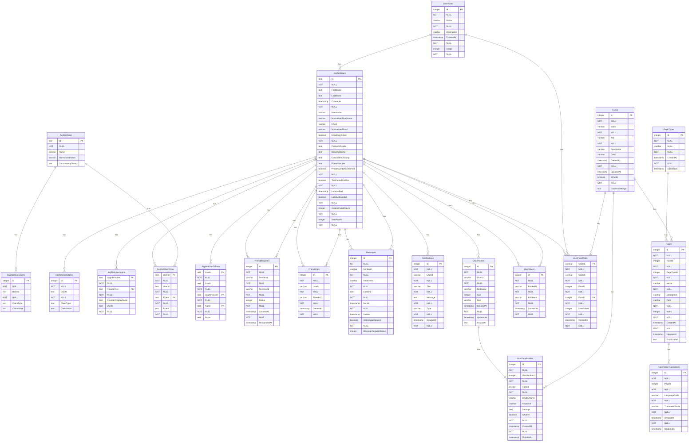

# Be Demo API

ASP.NET Core WebAPI project with Identity framework and PostgreSQL database.

## Overview

The Backend API (be_demo) provides a RESTful API for user authentication, authorization, and management. It uses ASP.NET Core Identity for user management, Entity Framework Core for database access, and PostgreSQL as the database backend.

## Features

- **User Authentication & Authorization**
  - OAuth2 token-based authentication
  - User registration and login
  - JWT token generation and validation
  - Refresh token support

- **Database Integration**
  - Entity Framework Core with PostgreSQL
  - Code-first migrations
  - Automatic database seeding (admin user creation)

- **Roles (global and face-scoped)**
  - **Global roles** (one per user): SUPER_ADMIN, ADMIN, USER, HOST — stored in `ApplicationUser.UserRoleId`.
  - **Face roles** (per user per face): FACE_ADMIN, FACE_USER, INZERENT, SUBSCRIBER, FACE_HOST — stored in `UserFaceRole` (UserId, FaceId, UserRoleId).
  - On **registration**: user gets global role **USER**; for each face they get **UserFaceRole** with **FACE_HOST**.
  - **First visit to a private face**: frontend can show a role selector; user chooses role and backend **PUT /api/faces/{id}/my-role** updates or creates `UserFaceRole`. Config endpoint returns **myFaceRoleId** / **myFaceRoleName** when called with Authorization.
  - See `UserRole.GlobalRoleNames`, `UserRole.FaceRoleNames`, and `RoleScope` (Global/Face).

- **Default pages when creating a face**
  - Creating a face (POST /api/faces) adds **Home** (`/home`). If the face is **non-public**, a **Wall** page (`/wall`) is added. **PageTypes** in CMS are only **`home`**, **`static`**, **`wall`** (e.g. login/register use `static` on the public face). Typed **list/detail** UIs are frontend routes, not CMS page types.

- **API Documentation**
  - Swagger/OpenAPI documentation
  - Interactive API explorer at `/swagger`

- **Structured Logging**
  - Serilog integration
  - Seq logging server for log viewing and analysis
  - Console and Seq sinks

- **SignalR Support**
  - Real-time communication via SignalR hubs
  - Chat hub implementation

- **Multi-Tenant Face-Based Routing**
  - URL-based tenant identification via face prefix (e.g., `/acme-corp/dashboard`)
  - Automatic URL rewriting from `/{face-prefix}/{path}` to `/api/{face-id}/{path}?requestFaceID={id}`
  - Face prefix matching using kebab-case conversion (e.g., "AcmeCorp" → "acme-corp")
  - In-memory caching for face data (5-minute TTL)
  - Public paths bypass face routing (`/api/`, `/swagger`, `/hubs`, etc.)
  - Face validation and 403 Forbidden response for invalid face prefixes

## Technologies

- **.NET 10.0** - Latest .NET runtime
- **ASP.NET Core WebAPI** - RESTful API framework
- **Entity Framework Core 10.0** - ORM for database access
- **ASP.NET Core Identity** - User authentication and authorization
- **PostgreSQL** - Relational database
- **Serilog** - Structured logging
- **Seq** - Log viewing and analysis server
- **Swagger/OpenAPI** - API documentation

## Project Structure

```
be_demo/
├── BeDemo.Api/              # Main API project
│   ├── Controllers/         # API controllers (Auth, OAuth2, Users, Faces, Pages)
│   ├── Services/            # Business logic services (IFaceService, FaceService)
│   ├── Models/              # Data models and DTOs
│   ├── Data/                # DbContext and data access
│   ├── Middlewares/         # Custom middleware (OAuth2, RoutingMiddleware)
│   ├── Utils/               # Utility classes (Routing helpers)
│   ├── Hubs/                # SignalR hubs
│   ├── Scripts/             # Initialization and health check scripts
│   └── Migrations/          # Database migrations
├── BeDemo.Api.Tests/        # Unit tests
├── docker-compose.dev.yml   # Docker Compose configuration for development
├── start-dev.sh             # Script to start development environment
├── stop-dev.sh              # Script to stop development environment
├── clear-dev.sh             # Script to clear containers and volumes
├── rebuild-dev.sh           # Script to rebuild Docker images
└── README.md                # This file
```

## Running

### Running in Docker Container (Recommended)

The easiest way to run the backend API in development:

```bash
./start-dev.sh
```

This script will:
1. Stop any existing containers
2. Create HTTPS certificate if needed
3. Build Docker images
4. Start containers (backend API and Seq logging server)
5. Run database migrations
6. Wait for services to be ready

The API will be available at:
- **HTTP**: `http://localhost:8000`
- **HTTPS**: `https://localhost:8001`
- **Swagger UI**: `http://localhost:8000/swagger`
- **Seq Logging UI**: `http://localhost:5341`

### Manual Docker Compose

```bash
docker-compose -f docker-compose.dev.yml up --build
```

### Stopping Services

```bash
./stop-dev.sh
```

Or manually:
```bash
docker-compose -f docker-compose.dev.yml down
```

### Clearing Everything

```bash
./clear-dev.sh
```

This removes containers, volumes, and images.

### Rebuilding Docker Images

To perform a clean rebuild of Docker images:

```bash
./rebuild-dev.sh
```

**Note**: This only builds images, it does NOT start containers. Use `./start-dev.sh` to start containers after rebuilding.

### Local Development (Without Docker)

1. **Ensure PostgreSQL is running** (see `db_demo` folder or root `start-all-dev.sh`)
2. **For job queue**: Redis via submodule `redis_demo` (`./start-redis.sh` or root `start-all-dev.sh`)

3. **Install .NET SDK 10.0**

4. **Restore dependencies**:
   ```bash
   cd BeDemo.Api
   dotnet restore
   ```

5. **Update database**:
   ```bash
   dotnet ef database update
   ```

6. **Run the application**:
   ```bash
   dotnet run --launch-profile http
   ```

   Or with HTTPS:
   ```bash
   dotnet run --launch-profile https
   ```

6. **Access Swagger UI**: `http://localhost:8000/swagger`

## API Endpoints

### Authentication

- `POST /api/auth/register` - Register a new user
  - Request body: `RegisterModel` (email, password, firstName, lastName)
  - Returns: User information

- `POST /api/auth/login` - Login with email and password
  - Request body: `LoginModel` (email, password)
  - Returns: User information and authentication token

- `POST /api/auth/logout` - Logout current user
  - Requires: Authentication header

### OAuth2

- `POST /api/oauth2/token` - Get OAuth2 access token
  - Request body: `OAuth2TokenRequest` (`grantType`, `username`, `password`, `clientId`, `clientSecret`, optional **`rememberMe`**)
  - **`rememberMe: true`** (password grant) selects **`Jwt:ExpiresInMinutesRememberMe`** for access-token lifetime; omitted/false uses **`Jwt:ExpiresInMinutes`**. See monorepo docs: [**authentication-and-sessions**](../docs/guides/authentication-and-sessions.md) / [**authentication-and-sessions-sk**](../docs/readmes/authentication-and-sessions-sk.md).
  - Returns: `OAuth2TokenResponse` with `accessToken`, `refreshToken`, `expiresIn` (seconds), `tokenType`
  - **Refresh grant:** `grant_type=refresh_token` rotates stored refresh tokens (see `OAuthRefreshTokenStore`); details in monorepo [**acl-and-capabilities**](../docs/guides/acl-and-capabilities.md).

- `POST /api/oauth2/register` - Register new user via OAuth2 flow
  - Request body: `OAuth2RegisterModel` (email, password, firstName, lastName)

### Users

- `GET /api/users` - Get all users (admin only)
- `GET /api/users/{id}` - Get user by ID
- `POST /api/users` - Create new user
- `PUT /api/users/{id}` - Update user
- `DELETE /api/users/{id}` - Delete user

### Faces

- `GET /api/faces` - Get all faces
- `GET /api/faces/config` - Get all faces with pages (for routing). When request includes Authorization, each face includes **myFaceRoleId** and **myFaceRoleName** for the current user.
- `GET /api/faces/face-roles` - Get list of face-scoped roles `[{ id, name }]` (for role selector on first visit to a private face).
- `GET /api/faces/{id}` - Get face by ID
- `PUT /api/faces/{id}/my-role` - Set current user's face role for this face. Body: `{ userRoleId }`. Creates or updates UserFaceRole.
- `POST /api/faces` - Create new face
- `PUT /api/faces/{id}` - Update face
- `DELETE /api/faces/{id}` - Delete face

### Pages

- `GET /api/pages` - Get all pages
- `GET /api/pages/{id}` - Get page by ID
- `POST /api/pages` - Create new page
- `PUT /api/pages/{id}` - Update page
- `DELETE /api/pages/{id}` - Delete page

### Page Types

- `GET /api/pagetypes` - Get all page types
- `GET /api/pagetypes/{id}` - Get page type by ID
- `POST /api/pagetypes` - Create new page type
- `PUT /api/pagetypes/{id}` - Update page type
- `DELETE /api/pagetypes/{id}` - Delete page type

For detailed API documentation, visit the Swagger UI at `http://localhost:8000/swagger` when the API is running.

## Multi-Tenant Face-Based Routing

The API implements multi-tenant routing using **face-based URL prefixes**. This allows each tenant (organization) to be identified by a unique face prefix in the URL, automatically scoping requests to that tenant.

### How It Works

When a request comes in with a face prefix (e.g., `/acme-corp/api/users`), the `RoutingMiddleware`:

1. **Extracts the face prefix** from the URL path (e.g., `acme-corp`)
2. **Converts to kebab-case** if needed (e.g., `AcmeCorp` → `acme-corp`)
3. **Looks up the face** in the database by matching the prefix against the `Face.Index` field
4. **Rewrites the URL** from `/{face-prefix}/{path}` to `/api/{face-id}/{path}?requestFaceID={id}`
5. **Returns 403 Forbidden** if no matching face is found for a route that requires it

### URL Transformation Examples

```
# Input URL (from frontend)
/acme-corp/dashboard

# Transformed to internal API call
/api/acme-corp/dashboard?requestFaceID=123

# Or for API endpoints
/acme-corp/api/users

# Transformed to
/api/acme-corp/users?requestFaceID=123
```

### Public Paths (Bypass Face Routing)

Certain paths bypass face routing and are accessible without a face prefix:

- `/api/` - Direct API access (when not prefixed with face)
- `/swagger` - Swagger UI documentation
- `/swagger-ui` - Swagger UI alternative
- `/openapi` - OpenAPI specification
- `/hubs` - SignalR hubs

### Face Matching Logic

1. Face prefix is extracted from the first URL segment
2. The prefix is converted to kebab-case (e.g., "AcmeCorp" → "acme-corp")
3. Database lookup finds a `Face` entity where `Face.Index` matches the prefix
4. If found, the `Face.Id` is added as `requestFaceID` query parameter
5. URL is rewritten to include the face ID in the path

### Configuration

The middleware is registered in `Program.cs`:

```csharp
// Register services
builder.Services.AddMemoryCache();
builder.Services.AddScoped<IFaceService, FaceService>();

// Add middleware (before OAuth2Middleware)
app.UseMiddleware<RoutingMiddleware>();
```

### Implementation Details

- **Caching**: Face data is cached in memory for 5 minutes to reduce database queries
- **Service**: `IFaceService` provides face lookup functionality
- **Utilities**: `Routing.cs` contains helper methods for path checking and kebab-case conversion
- **Performance**: Face cache reduces database load for frequently accessed faces

### Testing

Face routing is tested in the test suite. The middleware:
- Correctly identifies face prefixes in URLs
- Rewrites URLs with face ID
- Returns 403 for invalid face prefixes
- Bypasses public paths correctly

## Configuration

### Environment Variables

The API uses the following environment variables (configured in `docker-compose.dev.yml`):

- `ASPNETCORE_ENVIRONMENT` - Environment name (Development, Production, etc.)
- `ASPNETCORE_URLS` - URLs to bind to (e.g., `http://0.0.0.0:8000`)
- `ConnectionStrings__DefaultConnection` - PostgreSQL connection string
- `Serilog__WriteTo__1__Args__serverUrl` - Seq logging server URL

### Database Connection

The default connection string format:
```
Host=host.docker.internal;Port=54320;Database=bedemo;Username=bedemo_user;Password=bedemo_password
```

- **From Docker containers**: Use `host.docker.internal` as host
- **From localhost**: Use `localhost` as host
- **Database**: `bedemo`
- **Username**: `bedemo_user`
- **Password**: `bedemo_password`

### Logging

Logs are sent to:
1. **Console** (stdout) - Visible in Docker logs
2. **Seq** - Structured logging server at `http://seq:5341` (internal) or `http://localhost:5341` (host)

View logs:
```bash
# Docker logs
docker-compose -f docker-compose.dev.yml logs -f be-demo-api

# Seq UI
open http://localhost:5341
```

## Database Migrations

### Creating a Migration

```bash
cd BeDemo.Api
dotnet ef migrations add MigrationName
```

### Applying Migrations

```bash
# In Docker
docker-compose -f docker-compose.dev.yml exec be-demo-api dotnet ef database update

# Locally
cd BeDemo.Api
dotnet ef database update
```

### Removing Last Migration

```bash
cd BeDemo.Api
dotnet ef migrations remove
```

## Development Workflow

1. **Start database**: Ensure PostgreSQL is running (via `db_demo` or root `start-all-dev.sh`)

2. **Start Redis** (optional, for job queue): submodule `redis_demo` or `start-all-dev.sh`

3. **Start backend**: Run `./start-dev.sh` or use root `start-all-dev.sh` to start all services

4. **Make code changes**: Edit code in `BeDemo.Api/`

5. **Test changes**: 
   - API endpoints via Swagger UI
   - Unit tests: `dotnet test` in `BeDemo.Api.Tests/`

6. **View logs**: Check Docker logs or Seq UI

7. **Stop services**: Run `./stop-dev.sh` or root `stop-all-dev.sh`

## Testing

Run unit tests (no PostgreSQL required; tests use an in-memory database):

```bash
yarn test
# or from repo root: cd be_demo && yarn test
```

Tests cover:
- Authentication and authorization
- OAuth2 flows
- Edge cases and security scenarios
- SignalR hubs
- Performance tests

## Integration with Root Project

This backend is part of the `_mfai_demo` monorepo and integrates with:

- **Database**: `db_demo` (PostgreSQL)
- **Redis**: `redis_demo` (job queue)
- **Frontend**: `fe_demo` (React + Vite)
- **Admin**: `admin_demo` (React + Vite admin panel)
- **AI Demo**: `ai_demo` (Python gRPC server)
- **Logger Demo**: `logger_demo` (Dozzle log viewer)

Use root-level scripts to manage all services:
- `start-all-dev.sh` - Start all services
- `stop-all-dev.sh` - Stop all services
- `clear-all-dev.sh` - Clear all containers and volumes
- `status-all.sh` - Show status of all services
- `rebuild-all-dev.sh` - Rebuild all Docker images

## Troubleshooting

### Port Already Allocated

If port 8000 or 8001 is already in use:

```bash
# Find process using port
lsof -ti:8000,8001

# Kill process
lsof -ti:8000,8001 | xargs kill -9

# Or use clear script
./clear-dev.sh
```

### Database Connection Failed

- Ensure PostgreSQL container is running: `docker ps | grep postgres-dev`
- Check connection string in `docker-compose.dev.yml`
- Verify database credentials match `db_demo` configuration

### Seq Logging Server Not Accessible

- Ensure `seq-dev` container is running: `docker ps | grep seq-dev`
- Check Seq UI at `http://localhost:5341`
- Default credentials: `admin` / `admin`

### Migration Errors

- Ensure database is running and accessible
- Check connection string configuration
- Try removing and recreating migrations if needed

## Database Schema Diagram

The database schema diagram is automatically generated after each migration and displayed below:

<!-- AUTO-GENERATED DATABASE DIAGRAM - DO NOT EDIT -->




<!-- END AUTO-GENERATED DATABASE DIAGRAM -->

## Additional Documentation

- **Seq Logging**: See `SEQ_LOGGING.md` for detailed logging setup
- **HTTPS Certificates**: See `INSTALL_HTTPS_CERT.md` for HTTPS certificate setup
- **Docker**: See `docker-compose.dev.yml` for Docker configuration
