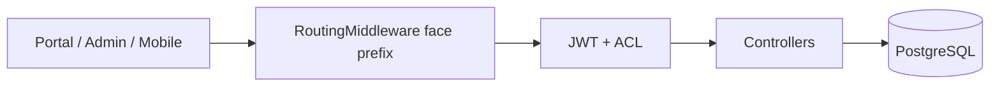

# Backend — detailed README (`many_faces_backend`)

Short runbook lives in **[`../README.md`](../README.md)**. This file is the **long index** for engineers working inside the submodule.

## What the API owns

- OAuth2 password + refresh grants, JWT, JWKS, face-scoped routing middleware.
- EF Core + PostgreSQL for faces, pages, social modules, moderation, stats, operator AI.
- SignalR hubs; Redis job workers; gRPC clients to **`many_faces_ai`**, optional mail/push/search workers.
- Platform operator routes under **`/admin/api/...`** — **`SUPER_ADMIN` only** ([`admin-superadmin-only-access.md`](../../docs/guides/admin-superadmin-only-access.md)).

## Reference split

| File | Contents |
| ---- | -------- |
| [`reference/01-features-running-and-api.md`](./reference/01-features-running-and-api.md) | Features, HTTP surface pointers, validation, localization |
| [`reference/02-routing-config-and-workflow.md`](./reference/02-routing-config-and-workflow.md) | Face prefixes, middleware, config keys |
| [`reference/03-testing-integration-and-troubleshooting.md`](./reference/03-testing-integration-and-troubleshooting.md) | `dotnet test`, integration filters, common failures |

**Route tables:** prefer **Swagger** + integration tests over duplicating every path here.

## Diagram: request path

## Submodule vs monorepo

| Keep in submodule | Keep in monorepo `docs/` |
| ----------------- | ------------------------ |
| Ports, `dotnet run`, proto regen, project layout | Cross-app policies, worker onboarding, agent prompts |
| This `docs/reference/` index | Canonical guides linked from [`docs/README.md`](../../docs/README.md) |
