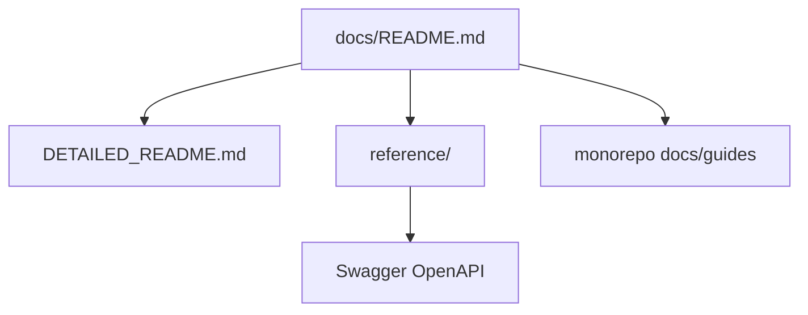

# Backend documentation index (`many_faces_backend/docs/`)

**Entry points**

| Document | Purpose |
| -------- | ------- |
| [`DETAILED_README.md`](./DETAILED_README.md) | Long-form backend narrative + links |
| [`reference/README.md`](./reference/README.md) | API surface index (Swagger is authoritative for routes) |

**Monorepo guides (cross-cutting truth)**

| Topic | Guide |
| ----- | ----- |
| Onboarding / CI | [`docs/guides/development.md`](../../docs/guides/development.md) |
| Auth & sessions | [`docs/guides/authentication-and-sessions.md`](../../docs/guides/authentication-and-sessions.md) |
| Platform operator ACL | [`docs/guides/admin-superadmin-only-access.md`](../../docs/guides/admin-superadmin-only-access.md) |
| Capabilities | [`docs/guides/acl-and-capabilities.md`](../../docs/guides/acl-and-capabilities.md) |
| Request validation | [`docs/guides/api-request-validation.md`](../../docs/guides/api-request-validation.md) |
| Migrations / seeds | [`docs/guides/efcore-migrations-and-seeding.md`](../../docs/guides/efcore-migrations-and-seeding.md) |
| Backend overview | [`docs/readmes/be-backend-overview.md`](../../docs/readmes/be-backend-overview.md) |

**Live API reference:** Swagger at `http://localhost:8000/swagger` when `be-demo-dev` is running.

