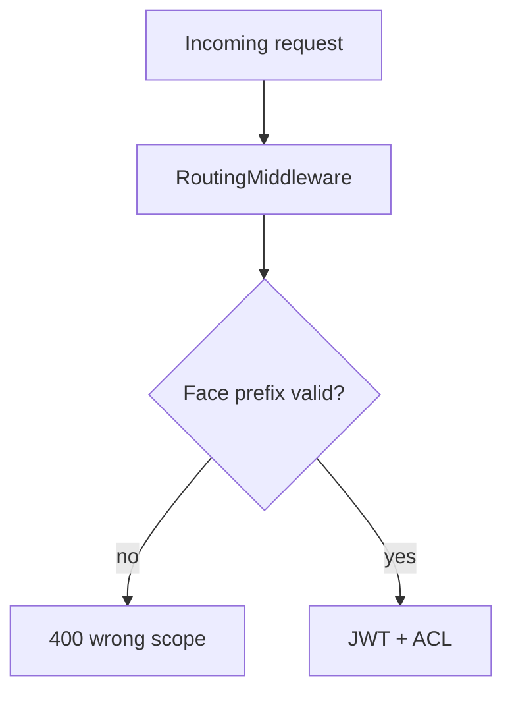

# Routing, configuration, and workflow

## Face URL prefixes

Requests are scoped by **`RoutingMiddleware`** to a face context (`public`, `admin`, tenant slug, …).

| Prefix              | Typical client         | Notes                                      |
| ------------------- | ---------------------- | ------------------------------------------ |
| `/public/api/...`   | Portal (default face)  | Anonymous + authenticated tenant APIs      |
| `/admin/api/...`    | **`many_faces_admin`** | Platform operator — **`SUPER_ADMIN` only** |
| `/{tenant}/api/...` | Portal on tenant face  | Face-scoped roles                          |

See [`authentication-and-sessions.md`](../../../docs/guides/authentication-and-sessions.md) and [`admin-superadmin-only-access.md`](../../../docs/guides/admin-superadmin-only-access.md).

## Exempt paths (no face prefix required)

Examples (see middleware source for full list):

- `POST /api/oauth2/token`, OAuth register flows
- `GET /api/localization/{app}` — static i18n bundles
- Health / swagger in development

## Configuration highlights

| Section             | Purpose                                  |
| ------------------- | ---------------------------------------- |
| `Jwt:*`             | Access + refresh lifetimes, signing keys |
| `Search:*`          | Optional Elasticsearch worker gRPC       |
| `Push:*` / `Mail:*` | Optional push/mailer workers             |
| `AiStats:*`         | Admin dashboard + SignalR stats modes    |

Worker env matrices: monorepo [`docker-and-compose.md`](../../../docs/guides/docker-and-compose.md).

## Diagram: face resolution

## Workflow

1. Edit code in `BeDemo.Api/`.
2. Add EF migration if schema changed — [`efcore-migrations-and-seeding.md`](../../../docs/guides/efcore-migrations-and-seeding.md).
3. Run `dotnet test` in `BeDemo.Api.Tests/`.
4. Bump `many_faces_proto` in one anchor checkout if wire contracts changed — [`git-submodules.md`](../../../docs/guides/git-submodules.md).
