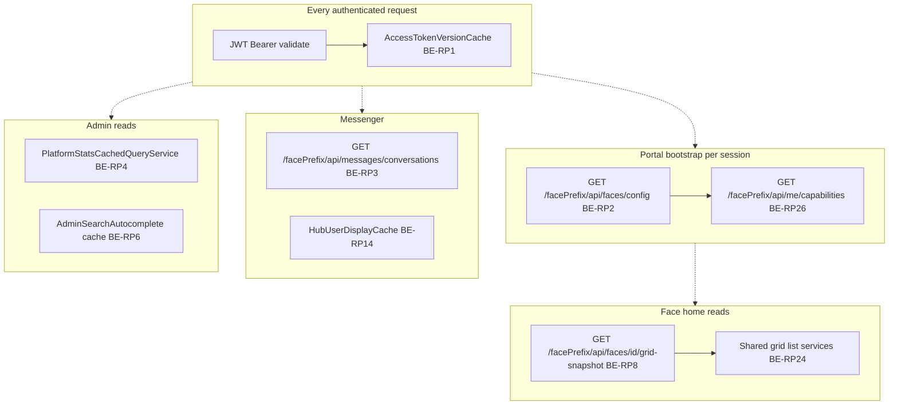
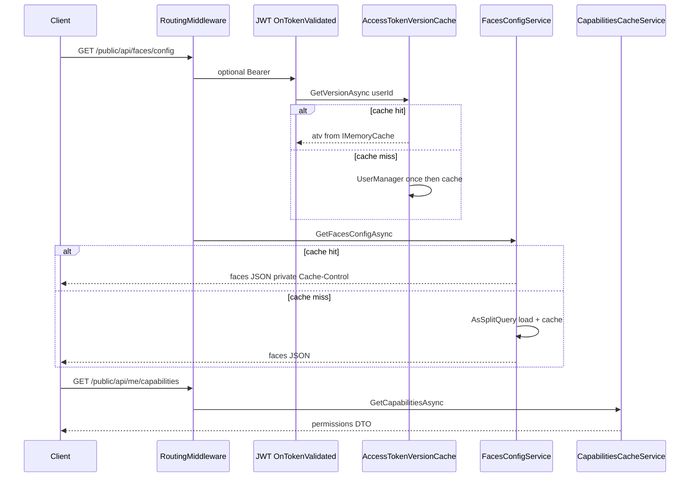

# Backend runtime performance v1

Engagement **BE-RP1…BE-RP35** for `many_faces_backend` — read-path latency, query fan-out reduction, caching, and measurement tooling (inspection **2026-05-21**, shipped **1.1.0**).

## Architecture (after v1)

## Request flow — JWT + bootstrap

## BE-RP index

| ID      | Theme                                              | Status in v1        |
| ------- | -------------------------------------------------- | ------------------- |
| BE-RP1  | JWT `AccessTokenVersion` IMemoryCache              | Shipped             |
| BE-RP2  | Faces config cache + AsSplitQuery                  | Shipped             |
| BE-RP3  | Messenger conversations SQL pagination             | Shipped             |
| BE-RP4  | Platform stats aggregation + cache                 | Shipped             |
| BE-RP5  | Search outbox parallel gRPC batch                  | Shipped             |
| BE-RP6  | Admin search autocomplete cache                    | Shipped             |
| BE-RP7  | Face routing cache async path                      | Shipped             |
| BE-RP8  | Grid snapshot BFF                                  | Shipped             |
| BE-RP9  | AsSplitQuery on heavy Include graphs               | Shipped             |
| BE-RP10 | DbContext pool evaluation                          | Waived (measured)   |
| BE-RP11 | Compiled queries for hot paths                     | Partial / follow-up |
| BE-RP12 | Cache-Control on safe GETs                         | Shipped (partial)   |
| BE-RP13 | AsNoTracking on read-only paths                    | Shipped             |
| BE-RP14 | SignalR hub user display cache                       | Shipped             |
| BE-RP15 | Npgsql connection pool tuning                      | Documented          |
| BE-RP16 | Search reconciliation batch tuning                 | Shipped (existing)  |
| BE-RP17 | Operator AI bundle query consolidation             | Waived              |
| BE-RP18 | Redis distributed ATV cache                        | Waived              |
| BE-RP19 | Middleware short-circuit audit                     | Partial             |
| BE-RP20 | Background worker poll interval tuning             | Partial             |
| BE-RP21 | Baseline script `backend-perf-baseline.mjs`        | Shipped             |
| BE-RP22 | Hot-path performance integration tests             | Shipped             |
| BE-RP23 | Chat room / video lounge list projection           | Partial             |
| BE-RP24 | Shared grid list services                          | Shipped             |
| BE-RP25 | Observability Activity spans                       | Waived              |
| BE-RP26 | Capabilities cache                                 | Shipped             |
| BE-RP27 | OAuth2 token warm path audit                       | Partial             |
| BE-RP28 | Upload serve Cache-Control + ETag                  | Shipped             |
| BE-RP29 | EF TagWith query tags                              | Shipped             |
| BE-RP30 | Read-replica runbook                               | Shipped (doc)       |
| BE-RP31 | Rate-limit interaction audit                       | Documented          |
| BE-RP32 | gRPC deadline defaults                             | Shipped             |
| BE-RP33 | ChatHub Operator AI read reduction                 | Partial             |
| BE-RP34 | Grid snapshot contract / golden JSON tests         | Shipped             |
| BE-RP35 | k6 load harness stub                               | Shipped (stub)      |

## Measurement

1. Start dev stack (`./scripts/start-all-dev.sh`) with API on **localhost:8000**.
2. `node scripts/backend-perf-baseline.mjs` — writes `dist/backend-perf-baseline.json` with p50/p95 per endpoint.
3. Optional load profile: `k6 run scripts/backend-load-test.k6.js` (requires [k6](https://k6.io/)).
4. Integration tests: `dotnet test BeDemo.Api.Tests --filter FullyQualifiedName~Performance`.
5. Compare before/after using the same seed data and JWT fixture env vars (see [`docs/guides/backend-performance.md`](../../docs/guides/backend-performance.md)).

## Related docs

- [`assets/runtime-performance-v1-flow.svg`](./assets/runtime-performance-v1-flow.svg) — static request-flow diagram
- [`../../docs/guides/backend-performance.md`](../../docs/guides/backend-performance.md) — ops tuning
- [`../../docs/guides/backend-read-replica.md`](../../docs/guides/backend-read-replica.md) — replica-safe endpoints
- [`../../docs/prompts/backend-runtime-performance-v1-agent-prompt.md`](../../docs/prompts/backend-runtime-performance-v1-agent-prompt.md)
